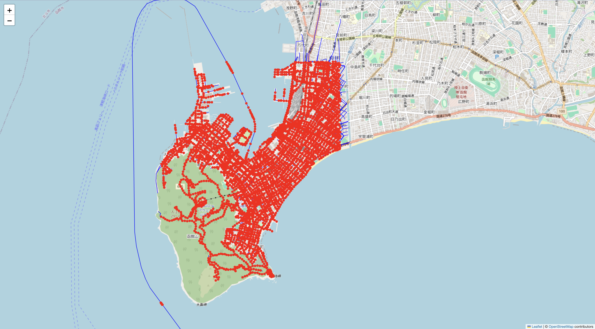
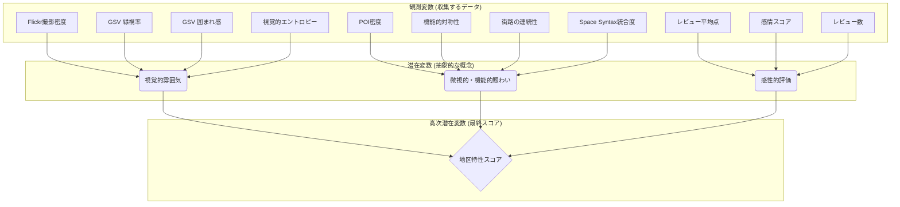
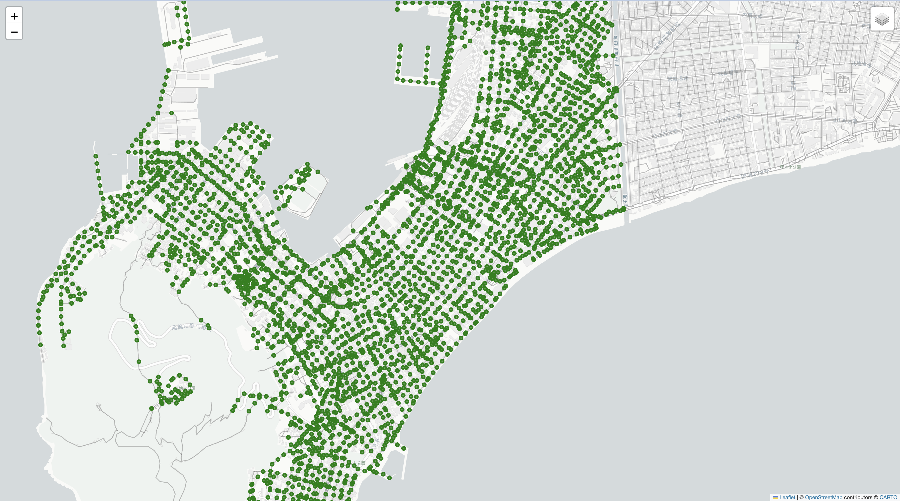
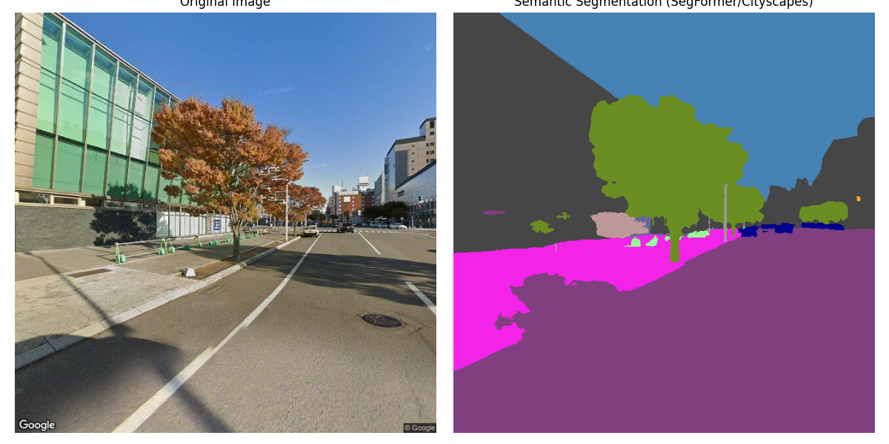

# 修士論文の研究取り組み

## 研究テーマ
**地区特性を考慮した観光ルート推薦システムの構築**

本研究は、機械学習モデルを用いて、観光地特有の雰囲気や情緒的な特性を定量化し、それを活用した新しい観光ルート推薦システムの構築を目指す

---

## 実験1: データ収集
### 手順
観光地の特性を分析するための基礎データとして、以下のソースから情報を収集
- **施設紹介文**: 函館市の観光公式サイト「はこぶら」から収集。
- **施設情報**: Google Places APIを利用して、POI（Point of Interest）のカテゴリや座標などを取得。
- **観光写真**: Flickr APIを通じて、観光客が撮影した写真を収集。

---

## 実験2: データ分析
収集したテキストデータを用いて、地区の特性を表現するためのベクトル表現を生成・評価

### 2-1. LDAによるトピッククラスタリング
#### 手順
「はこぶら」の施設紹介文全体に対してLDA（Latent Dirichlet Allocation）を適用し、トピックごとにPOIをクラスタリング

#### 結果
[**実験2-1の結果**](..docs/results/2-1.md)

Sentence-BERT（後述）で算出した紹介文ベクトルの類似度を元に評価したところ、LDAによるクラスタは、意味的なまとまりが弱いことが判明。これは、名詞の有無に関わらず同様の傾向が見られた。<br>

#### 考察
LDAは単語の共起に基づいてトピックを抽出するため、文脈や意味の類似性を捉えるのには限界があると考えらる。したがって、地区特性の分析手法としては不十分であると結論付ける。

---

### 2-2. 埋め込み表現によるベクトル化と比較
#### 手順
文脈を捉える能力に優れた事前学習済みモデルを用いて、施設紹介文の埋め込み表現（ベクトル）を作成
- **使用モデル**:
  - `Sentence-BERT`: 文章全体の意味を捉えることを得意とするモデル。
  - `CLIP`: テキストと画像を共通のベクトル空間で表現できるマルチモーダルモデル。
- **比較実験**:
  1.  **オリジナルベクトル**: 施設紹介文をそのままベクトル化。
  2.  **差分ベクトル**: 施設の「機能（カテゴリ）」を表すベクトルを差し引くことで、「情緒的な特性」のみを抽出しようと試みた（単純な減算と直交射影による方法を比較）。
  3.  **概念プローブ**: 「美味しいコーヒー」のような具体的な概念（フレーズ）との類似度を計算し、ベクトルの表現能力を評価。

#### 結果
[**実験2-2の結果**](..docs/results/2-2.md)
- Sentence-BERTでは、カテゴリベクトルを減算した方が、減算しない場合よりも意味的にまとまりのあるベクトル表現が得られた。
- 一方で、概念プローブによる評価では、ベクトル減算によって逆に重要な特性が失われてしまう「諸刃の剣」であることが示唆され、今回はこのアプローチが有効でないと判断。
- モデル比較では、CLIPよりもSentence-BERTの方が、概念に対してより妥当性の高いPOIを上位に表示する結果となった。

#### 考察
施設紹介文のベクトルから単純にカテゴリベクトルを引くだけでは、意図した「情緒的な特性」を綺麗に分離することは困難。現状では、減算を行わない**オリジナルの施設紹介文ベクトル（特にSentence-BERTによるもの）**を以降の分析で使用するのが最も妥当だと考えられる。

---

## 実験3: 階層的クラスタリングによる地区特性の定義
### 手順
実験2-2で得られたSentence-BERTの埋め込み表現に対し、階層的クラスタリングを適用。そして、行政区画内のクラスタ構成比率を「地区特性」と定義し、ルート生成を試みた。


### 結果・考察
[**実験3の結果**](..docs/results/3.md)
2023年10月中旬の学会でポスター発表を行った際、「クラスタの構成比率を地区特性とするのは論理に飛躍があるのではないか」との指摘を受けた。これは自身でも感じていた課題であり、この定義の妥当性が低いことを再認識した。
今後は、行政区画のような人為的なルールベースではなく、データそのものから地区のまとまり（エリア）をボトムアップに発見するアプローチが必要となる。

---

## 実験4: 画像特徴の加味
### 手順
施設紹介文だけでは機能面に偏りがちであるという仮説のもと、観光客が撮影したFlickrの画像が持つ「雰囲気」の情報を加えることを試みた。
- **使用モデル**: CLIP（テキストと画像を共通空間で扱えるため）
- **統合手法**: POIのテキストベクトルに対し、周辺で撮影された画像のベクトルを、POIと撮影地の距離に応じて重み付け（正規分布を利用）して加算。
  ```math
  combined\_vector = \alpha \cdot \text{text\_vector} + (1-\alpha) \frac{\sum (w_{geo} \cdot \text{image\_vector})}{\sum w_{geo}}
  ```
  ただし、テキストと無関係な画像ベクトルがノイズになることを防ぐため、テキストベクトルと画像ベクトルの類似度が中央値(`0.2287`)以上の画像のみを利用。

### 結果
[**実験4の結果**](..docs/results/4.md)

- **類似度分布**:
  
  <details>
    <summary>類似度スコア詳細 (クリックで展開)</summary>
    - 分析対象POI数: 29/50
    - 総類似度ペア数: 5035
    - 中央値: 0.2287
    - 上位25%のしきい値: 0.2523
    - 上位10%のしきい値: 0.2716
    - 上位5%のしきい値: 0.2822
  </details>

- **事例（ラッキーピエロ ベイエリア本店）**: テキストとの類似度が非常に高い（`0.3361`）と判定された画像は、近隣の「ハセガワストア」を写したもの。
  <br>
  *Photo by [inunami](https://www.flickr.com/photos/94693136@N05/) / [CC BY 2.0](https://creativecommons.org/licenses/by/2.0/deed.en)*

### 考察
テキストとの類似度が高いと判定された画像が、必ずしもそのPOIの「雰囲気」を正しく表現しているとは限らない。「ラッキーピエロ」の雰囲気を表現するために「ハセガワストア」の画像を加えるのは不適切だと考える。他の事例を見ても、関係のない画像が多数含まれており、単純な類似度でのフィルタリングには限界があると思う。また、画像ベクトルの和をとっているため、仮にそれぞれの画像が特性を捉えられても、総合で見るとぼんやりとした１つの画像ベクトルになってしまうため、適切ではないと考え、別の方法を模索する。


---

## 実験5: Google Street View API用画像取得地点の生成と可視化

### 目的
Google Street View APIで利用する画像を効率的に取得するため、函館市内の道路網に沿った撮影地点の座標を、指定した間隔で自動的に生成する。これにより、街の様子を体系的に網羅した画像データを収集するための基礎を築く。

### アプローチ
1.  **OpenStreetMap (OSM) データからの道路網抽出**:
    *   `hakodate_osm_raw.json`ファイルから、`highway`タグを持つすべての道路セグメントを抽出。
    *   （当初`.net.xml`ファイルの使用も検討したが、座標変換の複雑さから、緯度経度情報を含むOSM JSONデータを利用する方針に変更。）
2.  **道路に沿った座標の生成**:
    *   抽出した各道路セグメントに対し、指定された間隔（例: 50mまたは100m）で地理座標（緯度、経度）を補間して生成。
    *   短い道路でも最低1点は確実に取得されるようにし、道路の始点を基準に間隔を適用。
    *   `geopy`ライブラリを用いて、地球の丸みを考慮した正確な距離計算と座標補間を実施。
3.  **結果の可視化**:
    *   生成された座標点とOSMの道路網をインタラクティブな地図上にプロットし、取得地点の分布と道路カバー状況を視覚的に確認。
    *   `folium`ライブラリを使用し、HTML形式の地図ファイルを生成。

### 生成された成果物
*   **50m間隔：90,240ポイント**
    *   `./docs/results/road_points_visualization_50m_from_net_FULL.html` 
    <br>
*   **100m間隔：49,953ポイント**
    *   `./docs/results/road_points_visualization_100m_from_net_FULL.html` 
    <br>
*   **50m間隔（絞り込み後）：5,608ポイント**
    *   `./data/processed/road_points/road_points_50m_filtered.json`
    *   `./docs/results/road_points_visualization_50m_filtered.html`<br>
    <br>

*   **100m間隔（絞り込み後）：3,273ポイント**
    *   `./data/processed/road_points/road_points_100m_filtered.json`
    *   `./docs/results/road_points_visualization_100m_filtered.html`
    <br>


### 考察
この手法により、広範囲にわたる道路ネットワークからGoogle Street View APIで利用可能な撮影地点を、指定した密度で効率的かつ体系的にサンプリングできることが確認された。生成された可視化マップにより、サンプリング地点の網羅性と間隔の均一性を視覚的に評価することが可能である。

---

## 実験6: 構造方程式モデリング(SEM)による地区特性の定量化
「地区特性」という曖昧な概念を定量化するため、構造方程式モデリング（SEM）という統計手法を導入するアプローチを検討しました。SEMは、直接観測できない潜在変数（例：「雰囲気」）を、複数の観測可能な変数との因果関係からモデル化する手法です。

このアプローチでは、アンケートのような主観的データではなく、都市のビッグデータを観測変数として利用します。具体的には、以下の3つの潜在変数を定義し、それぞれに対応する客観的な指標を算出します。

1.  **視覚的雰囲気 (Visual Atmosphere)**
    -   `指標`: Flickrの撮影密度、Google Street Viewの緑視率・囲まれ感・視覚的エントロピーなど。
2.  **微視的・機能的賑わい (Micro-Functional Vibrancy)**
    -   `指標`: POIの密度、道路両側の施設の対称性、施設間隔の連続性、道路のネットワーク中心性（Space Syntax）など。
3.  **感性的評価 (Affective Quality)**
    -   `指標`: Googleレビューの平均評価点、レビューテキストの感情スコア、レビュー数など。

これらの観測変数を元に、SEMは「視覚」「機能」「感性」の3側面を統合した**地区特性スコア**を算出。これにより、これまで主観的にしか語れなかった「地区のらしさ」を、データに基づいた客観的な指標として扱うことが可能になると考える。

#### 構造モデル図
以下に、このアプローチで想定される構造モデルの概要を示します。下の四角（観測変数）から中央の円（潜在変数）への矢印が「測定モデル」を、中央の円から上のひし形（高次潜在変数）への矢印が「構造モデル」を表す。



---

## Google Street View画像収集ワークフロー (実験6以降)

実験5の成果を基盤とし、街の景観を体系的に収集・分析するためのワークフローを構築しました。このワークフローは、データの生成、収集、可視化の3つの主要なスクリプトから構成されます。

### 主な機能
- **道路ベースの座標点生成**: OpenStreetMap(OSM)データから道路網を抽出し、指定間隔で座標点を生成します。
- **バウンディングボックスによるフィルタリング**: 特定の地理的範囲内の道路のみを対象とします。
- **インテリジェントな画像収集**:
    - **コスト最適化**: 無料のMetadata APIで画像の有無を事前確認し、無駄なAPIコールを削減します。
    - **補間探索**: 50m間隔の点で画像が見つからない場合、その区間をさらに細かく探索し、データの欠損を防ぎます。
    - **地理的重複排除**: 収集済みの画像の近傍（例: 75m以内）では新たな画像を取得せず、サンプリングの偏りを抑制します。
- **複数方向の画像取得**: 1つの地点から複数方向（例: 北・東・南・西）の画像を一度に取得できます。
- **進捗の可視化**: 収集プロセスの詳細なログを記録し、インタラクティブな地図上に結果（成功・スキップ・失敗）を色分けして表示します。

### 実行手順

#### 1. セットアップ
**依存ライブラリのインストール**:
```bash
pip install geopy tqdm folium pandas
```

**.envファイルの作成**:
プロジェクトのルートに`.env`ファイルを作成し、Google APIキーを設定します。
```
GOOGLE_API_KEY="ここにあなたのAPIキーを記述"

# Street View画像収集をテストモードで実行する場合はtrue、本番モードはfalse
SV_TEST_MODE=true
```

---
#### 2. [ステップ1] 座標点の生成とフィルタリング
OSMデータから道路に沿った50m間隔の座標点を生成し、指定したバウンディングボックスで絞り込みます。

**コマンド**:
```bash
python src/preprocess/generate_and_filter_points.py
```

**出力**:
- `data/processed/road_points/road_points_per_way_50m_filtered.json`
  - フィルタリングされた、道路ごとの座標リスト。

---
#### 3. [ステップ2] Street View画像の収集
ステップ1で生成された座標リストに基づき、Street View画像を収集します。

**コマンド**:
```bash
python src/collect_data/get_street_view.py
```

**出力**:
- `data/raw/street_view_images_.../`: 画像ファイル群。
- `data/raw/street_view_images_.../fetch_log.json`: 全ての探索結果を記録した詳細ログ。
- `data/raw/street_view_images_.../pano_metadata.json`: 収集に成功した画像の`pano_id`と座標情報の対応表。
  - *出力ディレクトリはテストモードか本番モードかで変わります。*

---
#### 4. [ステップ3] 収集結果の可視化
ステップ2で生成されたログファイルを元に、どの地点で画像の取得に成功したかをインタラクティブな地図上にプロットします。

**コマンド** (ログファイルのパスを引数として渡します):
```bash
# テストモードの場合の例
python src/data_analysis/plot_fetch_status.py data/raw/street_view_images_test/fetch_log.json

# 本番モードの場合の例
# python src/data_analysis/plot_fetch_status.py data/raw/street_view_images_50m_optimized/fetch_log.json
```

**出力**:
- `fetch_status_map.html`: 取得に成功した地点（緑の点）がプロットされたインタラクティブ地図。

<br>
*図: `plot_fetch_status.py`で生成された収集結果の可視化例 (緑の点が取得成功地点)*


## 実験7: セマンティックセグメンテーションと緑地率計算
都市景観画像から詳細なオブジェクト（道路、建物、植生など）をピクセル単位で分類
- **使用したモデル**:
  - UNet / ResNet : 精度が悪い&分類できる対象が少ないように感じたため、断念
  - mask2former: 分類の精度は良かったが、ピクセル計算ができないため断念
  - Cityscapesデータセットで学習済みの`SegFormer`: 問題なくできたため、以降これを使用
- **処理**:
  - `vegetation`（植生）クラスの占有率を緑地率などを計算
  - 元の画像と色分けされたセグメンテーション結果を並べて可視化・保存
- **結果**:
  <br>
  ```
  --- クラス別占有率 ---
  class name      | occupancy (%)
  --------------- | ----------
  road            |    38.35%
  sidewalk        |     7.79%
  building        |    21.17%
  wall            |     0.12%
  fence           |     0.60%
  pole            |     0.12%
  traffic light   |     0.01%
  vegetation      |     9.98%
  terrain         |     0.16%
  sky             |    21.34%
  person          |     0.00%
  car             |     0.35%
  ------------------------
  緑地率 (vegetation): 9.98%
  ------------------------
  ```


## 今後の計画
### GNNによる地区特性の再定義
階層的クラスタリングの課題を踏まえ、今後はGraph Neural Network (GNN)を用いて地区特性の抽出を試みます。各POIをノードとし、POI間の関係性（距離やカテゴリの近さなど）をエッジとしてグラフを構築。GNNによって得られる各POIのベクトル表現に基づきクラスタリングすることで、よりデータドリブンな「エリア」を定義できると期待する。

---

## 総合的な考察・今後の検討事項
- **検索精度の向上**:
  現状のベクトル類似度検索では、「美味しいコーヒー」と検索してもコーヒー自体を提供しない関連施設が上位に来ることがある。これを改善するため、TF-IDFやBM25、SPLADEのような古典的・現代的なテキストマイニング手法を組み合わせ、キーワードのマッチング精度を向上させる必要がある。

- **地区特性の役割の再検討**:
  仮に検索システムを高度化できたとして、本研究のコアである「地区特性」をルート生成プロセスのどこに組み込むのか、その役割を再定義する必要がある。

- **画像情報の扱い**:
  単純な画像ベクトルの加算はノイズが多い。今後は、YOLOのような物体検出モデルを用いて画像の内容をフィルタリングするか、あるいは画像は使わずに周辺のPOIの統計情報（口コミ数など）を「雰囲気」の代理特徴として利用する方が現実的かもしれない。まずは後者のアプローチから試みる予定。

- **実験4の計算式**:
  複数まいの画像ベクトルの和を算出しているが、画像ベクトルの全体を取得すると、それぞれの特徴が失われてしまう可能性があるため、他の方法を模索する必要があると考える。

- **概念プローブの取り扱い**:
  特にCLIPについて、そもそも画像とテキストとの関連性を学習させているため、「美味しいコーヒーが飲めるお店」というフレーズとの類似度を測ることが不適切な可能性がある。

---

