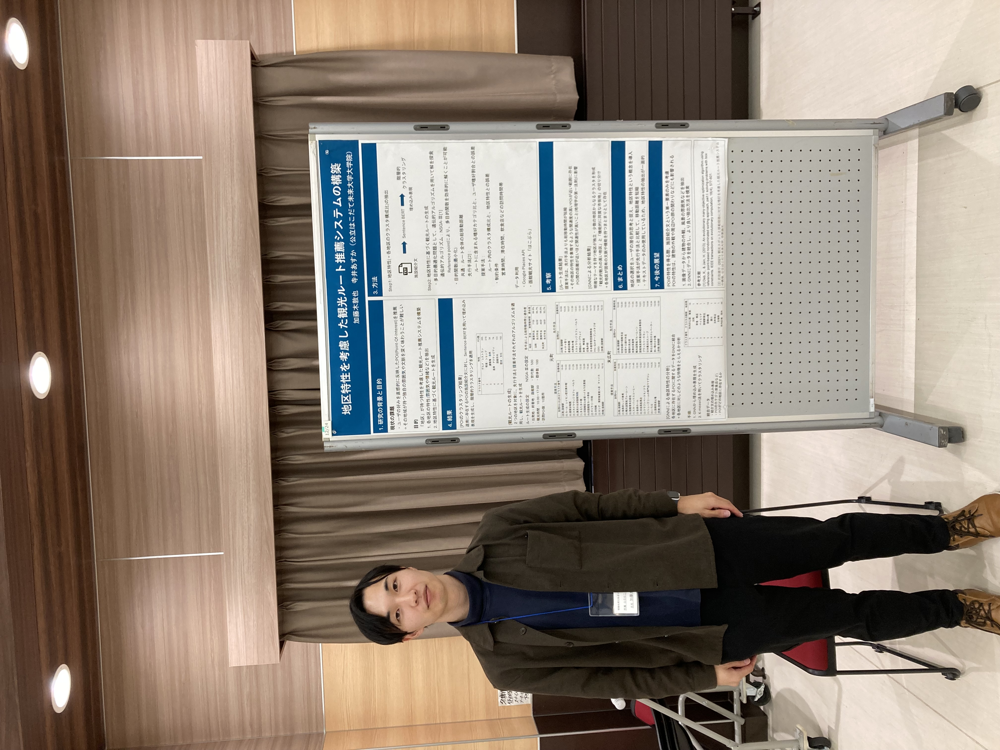
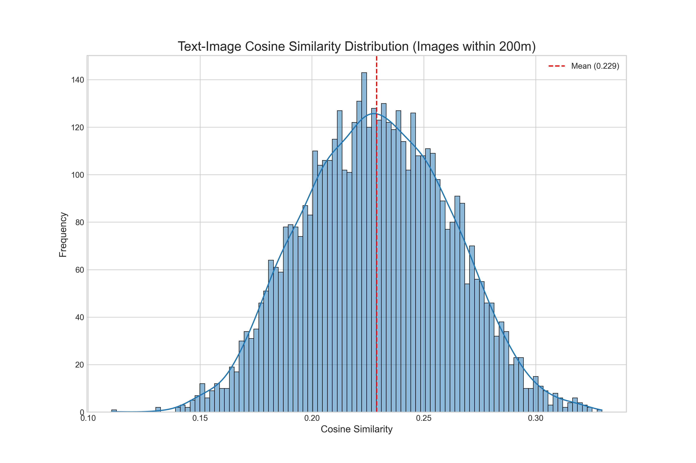
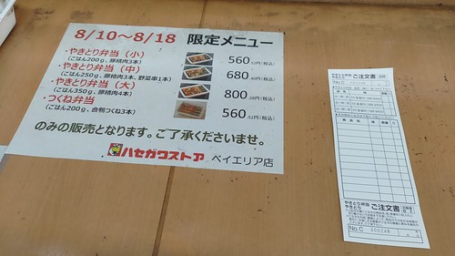

# 修士論文の研究取り組みを掲載する

### 研究テーマ
地区特性を考慮した観光ルート推薦システムの構築
機械学習モデルを用いて、観光地特有の雰囲気や情緒的な特性を求め、観光ルートに適用することを目指す。

### 手順
1. データ収集<br>
   施設紹介文「はこぶら」, Google Places API, Flickr
2. LDAとbertなどを用いたデータ分析<br>
   はこぶらから得た全ての施設紹介文に対し以下を適用した<br>
   2-1. LDAを用いて、トピックごとにクラスタリング<br>
      2-1-1. 2-2で求めたsentence-bertのベクトルからPOIの類似度を求め、LDAにより得られたクラスタが施設紹介文においてまとまりを持っているのか<br>
      -  名詞あり・なし問わず施設紹介文の意味的類似度は大したまとまりがないことがわかった<br>

   2-2. Sentence-BERTとCLIPテキストエンコーダで埋め込み表現を作成<br>
    - 2-2-1. 施設紹介文のオリジナルベクトル,施設紹介文ベクトルからカテゴリ(機能)ベクトルの単純な差分,直交射影による差分を試した
      - 特にsentence-bertでは、減算しないよりもまとまりのある結果が得られた。
    - 2-2-2. 概念プローブによる類似度計算
      - ベクトル減算は「諸刃の剣」であり、今回は「失敗」だった
 
3. 2.において、sentence-BERTから得られた埋め込み表現を階層的クラスタリングを適用し、分析<br>
   - 各地区においてのクラスタリング構成比率を地区特性と定義し、ルート生成を行い、10月中旬の学会でポスター発表した際、この構成比率を地区特性というのは無理があるのではないかという指摘をいただいた。もちろん、自分自身もそのように感じていたため、その認識が正しいことを思い知った。以降は、地区特性の定義について改めて考え直す。
   - 上記に従い、地区特性については、行政地区のようなルールベースで決めるのではなく、データに基づき、まとまりを得られるような手法を検討していくこととする。具体的にはグラフニューラルネットワークを用いて、周辺POIとの相互作用による影響を加味してみるのが良いかもしれない。
   
   


   <br>

4. 2-2-3に加えて、画像特徴も加味する<br>
感覚的に施設紹介文は、施設の機能面についての影響が大きいのではないかということで、Flickr画像をCLIPでベクトル化し、同じくCLIPでベクトル化した施設紹介文に、距離や類似度に応じて加算してみる。<br>
ただ、類似度の低い画像ベクトルを加えるとかえってノイズになってしまう可能性があるため、以下の中央値を閾値とする。<br>
画像とテキストを同じベクトル空間で表現したいため、CLIPを使用。<br>
   ```math
   combined\_vector = \alpha \, sentence\_vector + (1-\alpha)\frac{\sum ( w_{geo} \times image\_vector) }{\sum w_{geo}}
   ```
   ```math
   w_{geo}: 画像が撮影された場所とPOIの距離に応じた正規分布の重み
   ```

   <br>
   --- Similarity Score Percentiles ---<br>
  分析対象POI数: 29/50<br>
  総類似度ペア数: 5035<br>
  中央値: 0.2287<br>
  上位25%のしきい値: 0.2523<br>
  上位10%のしきい値: 0.2716<br>
  上位5%のしきい値: 0.2822<br><br>
  ラッキーピエロ　ベイエリア本店と類似度の高い画像<br>
  score: 0.3361, Dist: 21.5m<br>
  Photo by [inunami](https://www.flickr.com/photos/94693136@N05/) / [CC BY 2.0](https://creativecommons.org/licenses/by/2.0/deed.en)<br>
   結論、これをラッキーピエロの雰囲気に加味するのは違うのではないだろうか。類似度の高い他の画像も確認してみたが、確かに一部は園がお店で撮られたものもある一方で、やはり関係のないと思わざるを得ない画像も考慮してしまっている。


5. GNNを構築し、地区特性の抽出を試みる。<br>
Flickr画像は特定のPOIを撮影しているわけではないため、正規分布に従い、画像が撮影された周辺のPOIに重みを付与する。地区は行政地区を表すものではなく、GNNによって得られた各POIの重みについてクラスタリングを適用し、その結果得られたまとまりを地区と表現する。エリアと表現した方がニュアンスが近いかもしれない。
6. 以下を参考にロードサイドPOIの計算<br>
  (Zheng, Y. T., Yan, S., Zha, Z. J., Li, Y., Zhou, X., Chua, T. S., & Jain, R.
(2013). GPSView: A scenic driving route planner. ACM Transactions
on Multimedia Computing, Communications, and Applications
(TOMM), 9(1), 1-18.)

7. 


### 結果
- [**手順2-1の結果**](..docs/results/2-1.md)
- [**手順2-2の結果**](..docs/results/2-2.md)
- [**手順3の結果**](..docs/results/3.md)
- [**手順4の結果**](..docs/results/4.md)


### 考察
1. 手順2-1については、LDAを用いてトピックごとにクラスタを作成したが、施設紹介文をベクトル化し、類似度を計測した結果、クラスタごとに意味的なまとまりが見られないという結果となった。
2. 手順2-2については、取得した施設紹介文に対して、カテゴリベクトルを引くことで機能面を取り除くことを目指したが結果として、2-2-2で行った結果から減算することによりかえって、特性面が失われるという結果となった。<br>
結論,現状はオリジナルな施設紹介文ベクトルを使用することとする
3. 特になし
4. POIのテキストベクトルに、周辺の画像ベクトルを加えた結果<br>
  αの値が4-1と同じわけではないが、αの値が0.5から0.7に変化させると函館市内のPOIが増えていることがわかる。そのため、画像ベクトルを加えることで、本来持っていたテキストベクトルが曖昧なってしまうことが考えられる。手順4-2にも掲載したが、やはりテキストとの類似度が高い画像が、そのPOIを表しているわけではないということが大きく影響していると考えられる。


### 検討事項
- 結果2-2-3から、確かにそのフレーズを連想させるようなPOIが上位に表示されていると思う。ただ、例えば美味しいコーヒーというフレーズで類似度を求めた場合、コーヒーが出ず、その関連性の高いPOIが推薦されている。<br>
→ TF-IDFのようにテキストマイニングを行い、コーヒーという単語が出現し、尚且つ重要な指標として考慮するような仕組みを取り入れる必要があると考える。<br>
TF-IDF以外に,BM25(Best Match 25),SPLADE(SParse Lexical AnD Expansion model),再ランキングアプローチといった手法を検討する。

- POIベクトルからカテゴリーベクトルを差し引く意味はあるのか？<br>
→ ルートを生成する段階の時は、上述したように元のPOIベクトルとフレーズの類似性、TF-IDF等によるフレーズに含まれる単語の出現や重要性の考慮は必要になる。<br>
→ 一方で、地区特性を得る際には、素のPOIベクトルが良いのか、カテゴリーベクトルを差し引いた方がいいのかは要検討。

- 上記で述べたが、仮にルート生成時に、ベクトルマッチングとテキストマイニング手法を組み合わせた検索エンジンに似たシステムを構築した際、どこに地区特性の要素が加わるのだろうか。

- 2-2-3の結果から、CLIPよりもsentence-bertの方が上位に来るPOIの妥当性があるということがわかる。ただ、sentence-bertでは、画像と同じベクトル空間を表現できないため、sentence-bertの埋め込み表現をclipに写像できるようファインチューニングするという方法もありなのではないだろうか。

- 手順4の考察で述べたが、POIのテキストベクトルに加算する画像は選別する必要があるように思う。そのため、YOLOモデルで物体認識をすることも検討する。もしくは、POIの特性は、画像を使わずに、周辺のPOI状況や口コミ数などを考慮することが望ましいかもしれない。前者を取り入れるには、今後行う作業にとって負荷が大きいため、まずは後者を行なってみる。