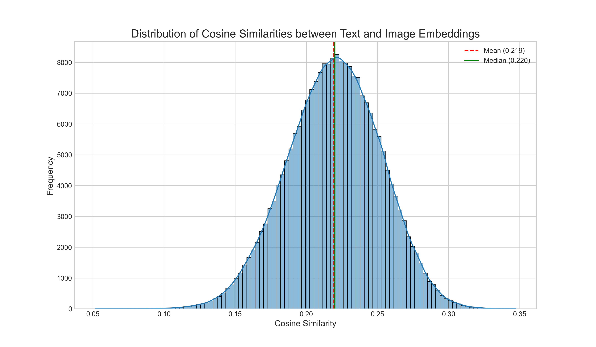

# 修士論文の研究取り組みを掲載する

### 研究テーマ
地区特性を考慮した観光ルート推薦システムの構築
機械学習モデルを用いて、観光地特有の雰囲気や情緒的な特性を求め、観光ルートに適用することを目指す。

### 手順
1. データ収集<br>
   施設紹介文「はこぶら」, Google Places API, Flickr
2. LDAとbertなどを用いたデータ分析<br>
   はこぶらから得た全ての施設紹介文に対し以下を適用した<br>
   2-1. LDAを用いて、トピックごとにクラスタリング<br>
      2-1-1. 2-2で求めたsentence-bertのベクトルからPOIの類似度を求め、LDAにより得られたクラスタが施設紹介文においてまとまりを持っているのか<br>
      -  名詞あり・なし問わず施設紹介文の意味的類似度は大したまとまりがないことがわかった<br>

   2-2. Sentence-BERTとCLIPテキストエンコーダで埋め込み表現を作成<br>
    - 2-2-1. 施設紹介文のオリジナルベクトル,施設紹介文ベクトルからカテゴリ(機能)ベクトルの単純な差分,直交射影による差分を試した
      - 特にsentence-bertでは、減算しないよりもまとまりのある結果が得られた。
    - 2-2-2. 概念プローブによる類似度計算
      - ベクトル減算は「諸刃の剣」であり、今回は「失敗」だった
 
3. 2.において、sentence-BERTから得られた埋め込み表現を階層的クラスタリングを適用し、分析<br>
   - 各地区においてのクラスタリング構成比率を地区特性と定義し、ルート生成を行い、10月中旬の学会でポスター発表した際、この構成比率を地区特性というのは無理があるのではないかという指摘をいただいた。もちろん、自分自身もそのように感じていたため、その認識が正しいことを思い知った。以降は、地区特性の定義について改めて考え直す。
   - 上記に従い、地区特性については、行政地区のようなルールベースで決めるのではなく、データに基づき、まとまりを得られるような手法を検討していくこととする。具体的にはグラフニューラルネットワークを用いて、周辺POIとの相互作用による影響を加味してみるのが良いかもしれない。
   
   


   <br>

4. 2-2-3に加えて、画像特徴も加味する<br>
  4-1. 
感覚的に施設紹介文は、施設の機能面についての影響が大きいのではないかということで、Flickr画像をCLIPでベクトル化し、同じくCLIPでベクトル化した施設紹介文に、距離や類似度に応じて加算してみる。<br>
画像とテキストを同じベクトル空間で表現したいため、CLIPを使用。
   ```math
   combined\_vector = \alpha \, text\_vector \times (1-\alpha)\sum (w_{sim} \times w_{geo} \times image\_vector) 
   ```
   ```math
   w_{sim}: 画像とテキストのコサイン類似度
   ```
   ```math
   w_{geo}: 画像が撮影された場所とPOIの距離に応じた正規分布の重み
   ```

   4-2. 4-1の結果では、画像枚数の少ない函館市外のPOIが類似度の上位に来てしまっていたため、１つの仮説として、類似度の低い画像も加算しているため、特徴が曖昧になってしまった可能性がある。そのため、画像とテキストの類似度の分布を参考に、類似度の閾値を決定し、閾値以上の類似度のみ反映することとする。
   


5. GNNを構築し、地区特性の抽出を試みる。<br>
Flickr画像は特定のPOIを撮影しているわけではないため、正規分布に従い、画像が撮影された周辺のPOIに重みを付与する。地区は行政地区を表すものではなく、GNNによって得られた各POIの重みについてクラスタリングを適用し、その結果得られたまとまりを地区と表現する。エリアと表現した方がニュアンスが近いかもしれない。
6. 以下を参考にロードサイドPOIの計算<br>
  (Zheng, Y. T., Yan, S., Zha, Z. J., Li, Y., Zhou, X., Chua, T. S., & Jain, R.
(2013). GPSView: A scenic driving route planner. ACM Transactions
on Multimedia Computing, Communications, and Applications
(TOMM), 9(1), 1-18.)

7. 


### 結果

<details><summary>2-1-1の実行結果　名詞あり　sentence-bert</summary>

```markdown:
--- 2. 埋め込み表現に基づくLDAクラスタ評価 ---

埋め込みに基づく全体のシルエットスコア (Cosine): 0.0127

--- クラスタごとの平均シルエットスコア (埋め込み) ---
label
0   -0.048397
1   -0.024757
3   -0.149527
4   -0.029827
5    0.010929
6    0.011178
7    0.128302
8    0.077550
9    0.000000
Name: score, dtype: float32

--- 3. 機能（types）に基づくLDAクラスタ評価 ---
動的に生成されたカテゴリ（types）の数: 151
/Users/atsuyakatougi/Desktop/master/venv/lib/python3.11/site-packages/sklearn/metrics/pairwise.py:2462: DataConversionWarning: Data was converted to boolean for metric jaccard
  warnings.warn(msg, DataConversionWarning)

機能的タイプに基づく全体のシルエットスコア (Jaccard): -0.0052

--- クラスタごとの平均シルエットスコア (機能) ---
/Users/atsuyakatougi/Desktop/master/venv/lib/python3.11/site-packages/sklearn/metrics/pairwise.py:2462: DataConversionWarning: Data was converted to boolean for metric jaccard
  warnings.warn(msg, DataConversionWarning)
label
0    0.003334
1   -0.002720
3   -0.035357
4   -0.004778
5    0.004738
6   -0.052790
7    0.089608
8   -0.010608
9    0.000000
Name: score, dtype: float64
```
</details>


<details><summary>2-1-1の実行結果　名詞なし　sentence-bert</summary>

```markdown:
--- 2. 埋め込み表現に基づくLDAクラスタ評価 ---

埋め込みに基づく全体のシルエットスコア (Cosine): -0.1310

--- クラスタごとの平均シルエットスコア (埋め込み) ---
label
0   -0.049909
1   -0.029548
2   -0.086759
3   -0.197971
4   -0.026067
5   -0.153769
6   -0.132985
7   -0.066479
8   -0.398607
9   -0.087607
Name: score, dtype: float32

--- 3. 機能（types）に基づくLDAクラスタ評価 ---
動的に生成されたカテゴリ（types）の数: 151
/Users/atsuyakatougi/Desktop/master/venv/lib/python3.11/site-packages/sklearn/metrics/pairwise.py:2462: DataConversionWarning: Data was converted to boolean for metric jaccard
  warnings.warn(msg, DataConversionWarning)

機能的タイプに基づく全体のシルエットスコア (Jaccard): -0.0596

--- クラスタごとの平均シルエットスコア (機能) ---
/Users/atsuyakatougi/Desktop/master/venv/lib/python3.11/site-packages/sklearn/metrics/pairwise.py:2462: DataConversionWarning: Data was converted to boolean for metric jaccard
  warnings.warn(msg, DataConversionWarning)
label
0   -0.052181
1   -0.021415
2   -0.048258
3   -0.067847
4   -0.046614
5   -0.065878
6   -0.068717
7   -0.056811
8   -0.095622
9   -0.064143
Name: score, dtype: float64
```
</details>

<details><summary>2-2-1の実行結果　sentence-bert</summary>

```markdown:
============================================================
                    1. 定性評価：類似度検索
============================================================


▼▼▼ プローブ施設: 基坂 ▼▼▼

[埋め込み: オリジナル]
--- 「基坂」との類似度トップ10 ---
 1. 魚見坂 (類似度: 0.9866)
 2. 大三坂 (類似度: 0.9821)
 3. 護国神社坂 (類似度: 0.9820)
 4. 元町公園 (類似度: 0.9811)
 5. 南部坂 (類似度: 0.9810)
 6. 弥生坂 (類似度: 0.9806)
 7. 函館八幡宮 (類似度: 0.9804)
 8. 二十間坂 (類似度: 0.9803)
 9. 八幡坂 (類似度: 0.9803)
10. 咬菜園跡 (類似度: 0.9796)
----------------------------------------

[埋め込み: 単純減算]
--- 「基坂」との類似度トップ10 ---
 1. 南部坂 (類似度: 0.9557)
 2. 大三坂 (類似度: 0.9478)
 3. 日和坂 (類似度: 0.9465)
 4. 二十間坂 (類似度: 0.9460)
 5. 護国神社坂 (類似度: 0.9387)
 6. 八幡坂 (類似度: 0.9375)
 7. 弥生坂 (類似度: 0.9371)
 8. 東坂 (類似度: 0.9306)
 9. 谷地坂 (類似度: 0.9305)
10. 魚見坂 (類似度: 0.9294)
----------------------------------------

[埋め込み: 直交射影]
--- 「基坂」との類似度トップ10 ---
 1. 南部坂 (類似度: 0.9468)
 2. 大三坂 (類似度: 0.9429)
 3. 二十間坂 (類似度: 0.9393)
 4. 日和坂 (類似度: 0.9362)
 5. 護国神社坂 (類似度: 0.9350)
 6. 魚見坂 (類似度: 0.9335)
 7. 弥生坂 (類似度: 0.9329)
 8. 八幡坂 (類似度: 0.9327)
 9. 東坂 (類似度: 0.9259)
10. 谷地坂 (類似度: 0.9256)
----------------------------------------

▼▼▼ プローブ施設: 道の駅 なないろ・ななえ ▼▼▼

[埋め込み: オリジナル]
--- 「道の駅 なないろ・ななえ」との類似度トップ10 ---
 1. ショッピング＆フードエリア「ほっくる」 (類似度: 0.9864)
 2. BENTO CAFE 41°GARDEN (類似度: 0.9849)
 3. じゃがいもFACTORY (類似度: 0.9848)
 4. はこだて海鮮市場本店 (類似度: 0.9842)
 5. NANAIRO FACTORY (類似度: 0.9841)
 6. 3valley (類似度: 0.9837)
 7. 函館山山頂展望台テイクアウトコーナー (類似度: 0.9835)
 8. Glacier ‘c’est chouette ! (類似度: 0.9833)
 9. THE HAKODATE DEPART (類似度: 0.9833)
10. パティスリージョリ・クレール (類似度: 0.9833)
----------------------------------------

[埋め込み: 単純減算]
--- 「道の駅 なないろ・ななえ」との類似度トップ10 ---
 1. 道の駅 しかべ間歇泉公園 (類似度: 0.9462)
 2. 道の駅 つど～る・プラザ・さわら (類似度: 0.9279)
 3. 道の駅 YOU・遊・もり (類似度: 0.9273)
 4. ほっとマルシェおがーる (類似度: 0.9268)
 5. BENTO CAFE 41°GARDEN (類似度: 0.9213)
 6. 八雲町情報交流物産館「丘の駅」 (類似度: 0.9204)
 7. 道の駅 みそぎの郷 きこない (類似度: 0.9176)
 8. キラリス函館 (類似度: 0.9159)
 9. モンモランシー（函館国際ホテル） (類似度: 0.9143)
10. 北前船 松前 (類似度: 0.9135)
----------------------------------------

[埋め込み: 直交射影]
--- 「道の駅 なないろ・ななえ」との類似度トップ10 ---
 1. 道の駅 しかべ間歇泉公園 (類似度: 0.9392)
 2. ほっとマルシェおがーる (類似度: 0.9249)
 3. BENTO CAFE 41°GARDEN (類似度: 0.9248)
 4. 道の駅 つど～る・プラザ・さわら (類似度: 0.9229)
 5. 八雲町情報交流物産館「丘の駅」 (類似度: 0.9212)
 6. ショッピング＆フードエリア「ほっくる」 (類似度: 0.9203)
 7. 道の駅 YOU・遊・もり (類似度: 0.9184)
 8. THE HAKODATE DEPART (類似度: 0.9175)
 9. キラリス函館 (類似度: 0.9174)
10. NANAIRO FACTORY (類似度: 0.9138)
----------------------------------------

▼▼▼ プローブ施設: 函館朝市 ▼▼▼

[埋め込み: オリジナル]
--- 「函館朝市」との類似度トップ10 ---
 1. 中島廉売 (類似度: 0.9863)
 2. 函館朝市ひろば (類似度: 0.9854)
 3. 八雲町情報交流物産館「丘の駅」 (類似度: 0.9851)
 4. 回転寿司 函館まるかつ水産本店 (類似度: 0.9839)
 5. はこだて海鮮市場本店 (類似度: 0.9835)
 6. はこだて自由市場 (類似度: 0.9828)
 7. 函館朝市どんぶり横丁市場 (類似度: 0.9825)
 8. ヤマチュウ食品 日乃出店 (類似度: 0.9823)
 9. はこだて海鮮市場 いかいか亭 (類似度: 0.9817)
10. ハセガワストア　中道店 (類似度: 0.9815)
----------------------------------------

[埋め込み: 単純減算]
--- 「函館朝市」との類似度トップ10 ---
 1. 函館朝市ひろば (類似度: 0.9492)
 2. 中島廉売 (類似度: 0.9330)
 3. 八雲町情報交流物産館「丘の駅」 (類似度: 0.9043)
 4. 道の駅 しかべ間歇泉公園 (類似度: 0.9043)
 5. はこだて自由市場 (類似度: 0.9016)
 6. 道の駅 つど～る・プラザ・さわら (類似度: 0.8972)
 7. キラリス函館 (類似度: 0.8960)
 8. 道の駅 みそぎの郷 きこない (類似度: 0.8951)
 9. モンモランシー（函館国際ホテル） (類似度: 0.8946)
10. 道の駅 YOU・遊・もり (類似度: 0.8886)
----------------------------------------

[埋め込み: 直交射影]
--- 「函館朝市」との類似度トップ10 ---
 1. 函館朝市ひろば (類似度: 0.9483)
 2. 中島廉売 (類似度: 0.9399)
 3. 八雲町情報交流物産館「丘の駅」 (類似度: 0.9208)
 4. はこだて自由市場 (類似度: 0.9159)
 5. 道の駅 しかべ間歇泉公園 (類似度: 0.9110)
 6. モンモランシー（函館国際ホテル） (類似度: 0.9025)
 7. 道の駅 つど～る・プラザ・さわら (類似度: 0.9016)
 8. はこだて海鮮市場本店 (類似度: 0.9008)
 9. キラリス函館 (類似度: 0.9007)
10. 道の駅 みそぎの郷 きこない (類似度: 0.9003)
----------------------------------------

============================================================
                  2. 定量評価：クラスタリング
============================================================

--- シルエットスコアによるクラスタリング評価結果 ---
（クラスタ数 k=8）

埋め込み: オリジナル      | シルエットスコア: 0.0448
埋め込み: 単純減算       | シルエットスコア: 0.0822
埋め込み: 直交射影       | シルエットスコア: 0.0715

※スコアが高いほど、クラスタが密で、よく分離されていることを示す。
============================================================

```
</details>

<details><summary>2-2-2の実行結果　clip</summary>

```markdown:
============================================================
                    1. 定性評価：類似度検索
============================================================


▼▼▼ プローブ施設: 基坂 ▼▼▼

[埋め込み: オリジナル]
--- 「基坂」との類似度トップ10 ---
 1. 武田斐三郎先生顕彰碑 (類似度: 0.9724)
 2. 幸坂 (類似度: 0.9675)
 3. 日本最古のコンクリート電柱 (類似度: 0.9673)
 4. 日本基督教団函館教会 (類似度: 0.9644)
 5. 喫茶ニューサロン海峡 (類似度: 0.9643)
 6. 亀井勝一郎文学碑 (類似度: 0.9641)
 7. 常盤坂 (類似度: 0.9635)
 8. 鮨金分店 (類似度: 0.9616)
 9. 姥神大神宮 (類似度: 0.9616)
10. 大三坂 (類似度: 0.9607)
----------------------------------------

[埋め込み: 単純減算]
--- 「基坂」との類似度トップ10 ---
 1. 幸坂 (類似度: 0.8521)
 2. 蕎麦彩彩　久留葉 (類似度: 0.8101)
 3. 武田斐三郎先生顕彰碑 (類似度: 0.8020)
 4. 常盤坂 (類似度: 0.7876)
 5. 土饅頭 (類似度: 0.7813)
 6. 大三坂 (類似度: 0.7727)
 7. まるたま小屋 (類似度: 0.7700)
 8. 鮨金分店 (類似度: 0.7699)
 9. ギャラリー村岡 (類似度: 0.7579)
10. 北海道坂本龍馬記念館 (類似度: 0.7577)
----------------------------------------

[埋め込み: 直交射影]
--- 「基坂」との類似度トップ10 ---
 1. 幸坂 (類似度: 0.8289)
 2. 武田斐三郎先生顕彰碑 (類似度: 0.7956)
 3. 蕎麦彩彩　久留葉 (類似度: 0.7946)
 4. 土饅頭 (類似度: 0.7644)
 5. 常盤坂 (類似度: 0.7540)
 6. 鮨金分店 (類似度: 0.7529)
 7. 大三坂 (類似度: 0.7490)
 8. まるたま小屋 (類似度: 0.7440)
 9. 喫茶ニューサロン海峡 (類似度: 0.7439)
10. ギャラリー村岡 (類似度: 0.7420)
----------------------------------------

▼▼▼ プローブ施設: 道の駅 なないろ・ななえ ▼▼▼

[埋め込み: オリジナル]
--- 「道の駅 なないろ・ななえ」との類似度トップ10 ---
 1. 湯の沢水辺公園 (類似度: 0.9575)
 2. サラキ岬 (類似度: 0.9519)
 3. 函館七飯ゴンドラ (類似度: 0.9504)
 4. 城岱牧場（管理棟展望台） (類似度: 0.9503)
 5. 道の駅 なとわ・えさん (類似度: 0.9474)
 6. 噴火湾ビューポイント（北斗船歌碑） (類似度: 0.9427)
 7. 道の駅 あっさぶ (類似度: 0.9424)
 8. 鶉ダムオートキャンプ場ハチャムの森 (類似度: 0.9416)
 9. 道の駅 しりうち (類似度: 0.9408)
10. 空港緑地　志海苔ふれあい広場パークゴルフ場 (類似度: 0.9407)
----------------------------------------

[埋め込み: 単純減算]
--- 「道の駅 なないろ・ななえ」との類似度トップ10 ---
 1. 函館七飯ゴンドラ (類似度: 0.8257)
 2. 城岱牧場（管理棟展望台） (類似度: 0.8223)
 3. サラキ岬 (類似度: 0.8198)
 4. 湯の沢水辺公園 (類似度: 0.8079)
 5. 中島三郎助父子最後之地 (類似度: 0.8063)
 6. 噴火湾ビューポイント（北斗船歌碑） (類似度: 0.8036)
 7. 空港緑地　志海苔ふれあい広場パークゴルフ場 (類似度: 0.8034)
 8. 道の駅 なとわ・えさん (類似度: 0.8017)
 9. 津軽海峡フェリー函館ターミナル売店 (類似度: 0.7981)
10. 道の駅 みそぎの郷 きこない (類似度: 0.7980)
----------------------------------------

[埋め込み: 直交射影]
--- 「道の駅 なないろ・ななえ」との類似度トップ10 ---
 1. サラキ岬 (類似度: 0.8024)
 2. 函館七飯ゴンドラ (類似度: 0.7961)
 3. 城岱牧場（管理棟展望台） (類似度: 0.7946)
 4. 湯の沢水辺公園 (類似度: 0.7901)
 5. 道の駅 なとわ・えさん (類似度: 0.7887)
 6. 中島三郎助父子最後之地 (類似度: 0.7684)
 7. 空港緑地　志海苔ふれあい広場パークゴルフ場 (類似度: 0.7678)
 8. 噴火湾ビューポイント（北斗船歌碑） (類似度: 0.7659)
 9. 築城果樹園（収穫体験） (類似度: 0.7592)
10. ニヤマ高原スキー場 (類似度: 0.7562)
----------------------------------------

▼▼▼ プローブ施設: 函館朝市 ▼▼▼

[埋め込み: オリジナル]
--- 「函館朝市」との類似度トップ10 ---
 1. 函館ダイニング　雅家 (類似度: 0.9154)
 2. 海鮮味処 すずや食堂 (類似度: 0.9142)
 3. コメダ珈琲店 函館ベイエリア店 (類似度: 0.9141)
 4. 十字屋珈琲店 (類似度: 0.9138)
 5. ニヤマ高原スキー場 (類似度: 0.9102)
 6. 回転寿司 函館まるかつ水産本店 (類似度: 0.9100)
 7. きくよ食堂　本店 (類似度: 0.9096)
 8. 築城果樹園（収穫体験） (類似度: 0.9069)
 9. 鯉之助 (類似度: 0.9066)
10. 函館麺厨房あじさい　本店 (類似度: 0.9059)
----------------------------------------

[埋め込み: 単純減算]
--- 「函館朝市」との類似度トップ10 ---
 1. 函館ダイニング　雅家 (類似度: 0.8039)
 2. 鯉之助 (類似度: 0.7790)
 3. きくよ食堂　本店 (類似度: 0.7759)
 4. コメダ珈琲店 函館ベイエリア店 (類似度: 0.7644)
 5. 日本料理 うなぎ 松前（函館国際ホテル） (類似度: 0.7629)
 6. 炭火割烹 菊川 (類似度: 0.7627)
 7. 函館麺厨房あじさいJR函館駅店 (類似度: 0.7563)
 8. 函館麺厨房あじさい　本店 (類似度: 0.7526)
 9. 十字屋珈琲店 (類似度: 0.7517)
10. 回転寿司 函館まるかつ水産本店 (類似度: 0.7503)
----------------------------------------

[埋め込み: 直交射影]
--- 「函館朝市」との類似度トップ10 ---
 1. 函館ダイニング　雅家 (類似度: 0.7329)
 2. きくよ食堂　本店 (類似度: 0.7112)
 3. コメダ珈琲店 函館ベイエリア店 (類似度: 0.7080)
 4. 鯉之助 (類似度: 0.7064)
 5. 十字屋珈琲店 (類似度: 0.7014)
 6. 回転寿司 函館まるかつ水産本店 (類似度: 0.6930)
 7. 日本料理 うなぎ 松前（函館国際ホテル） (類似度: 0.6899)
 8. 函館麺厨房あじさい　本店 (類似度: 0.6881)
 9. 炭火割烹 菊川 (類似度: 0.6778)
10. ニヤマ高原スキー場 (類似度: 0.6636)
----------------------------------------

============================================================
                  2. シルエットスコアによるクラスタリング
============================================================
埋め込み: オリジナル      | シルエットスコア: 0.0475
埋め込み: 単純減算       | シルエットスコア: 0.0430
埋め込み: 直交射影       | シルエットスコア: 0.0389
（クラスタ数 k=8）
※スコアが高いほど、クラスタが密で、よく分離されていることを示す。
============================================================

考察
オリジナル埋め込み表現に対して差分をとっても類似度の高いPOI(Point-of-Interest)に大きな違いが見られないため、差分を引いてPOIの機能面を取り除き、特性だけを抽出するということができないことが示唆される
```
</details>


<details><summary>2-2-3の実行結果　sentence-bert</summary>

```markdown:
============================================================
                    概念プローブによる類似度検索
  ============================================================


  ▼▼▼ 概念プローブ: 「静かな場所」 ▼▼▼

  [埋め込み: オリジナル]
  --- 「静かな場所」に最も近い施設トップ10 ---
   1. 鳥崎八景 (類似度: 0.7482)
   2. 湯の沢水辺公園 (類似度: 0.7372)
   3. 大千軒岳 (類似度: 0.7337)
   4. オートリゾート八雲 (類似度: 0.7309)
   5. 水無海浜温泉 (類似度: 0.7275)
   6. 根崎公園 (類似度: 0.7258)
   7. 函館市戸井ウォーターパーク　オートキャンプ場 (類似度: 0.7252)
   8. カネモリブリックラボ (類似度: 0.7246)
   9. 穴澗海岸 (類似度: 0.7240)
  10. 恵山シーサイドパークゴルフ場 (類似度: 0.7232)
  --------------------------------------------------

  [埋め込み: 単純減算]
  --- 「静かな場所」に最も近い施設トップ10 ---
   1. カネモリブリックラボ (類似度: -0.0638)
   2. 寿し輝分店 (類似度: -0.0675)
   3. 西ふ頭 (類似度: -0.0681)
   4. 北斗市運動公園 (類似度: -0.0705)
   5. 四季風味 ささ樹 (類似度: -0.0757)
   6. 鳥崎八景 (類似度: -0.0787)
   7. 鷲ノ木遺跡・ストーンサークル (類似度: -0.0795)
   8. Endeavour To Go 二十間坂 (類似度: -0.0826)
   9. 川汲公園 (類似度: -0.0828)
  10. JRA函館競馬場 (類似度: -0.0830)
  --------------------------------------------------

  [埋め込み: 直交射影]
  --- 「静かな場所」に最も近い施設トップ10 ---
   1. Endeavour To Go 二十間坂 (類似度: 0.3341)
   2. はこだて工芸舎 (類似度: 0.2834)
   3. 西ふ頭 (類似度: 0.2661)
   4. 茶房　無垢里（グルメ） (類似度: 0.2635)
   5. SUQ+ (類似度: 0.2586)
   6. cafe 海と硝子 (類似度: 0.2539)
   7. ANTICA OSTERIA DELL'ALBA (類似度: 0.2530)
   8. 地酒・ワイン屋 みのや (類似度: 0.2510)
   9. 山田農場 (類似度: 0.2450)
  10. じゃがいもFACTORY (類似度: 0.2418)
  --------------------------------------------------

  ▼▼▼ 概念プローブ: 「景色が良い」 ▼▼▼

  [埋め込み: オリジナル]
  --- 「景色が良い」に最も近い施設トップ10 ---
   1. 根崎公園 (類似度: 0.8013)
   2. 函館空港 (類似度: 0.8012)
   3. 大千軒岳 (類似度: 0.7997)
   4. ニヤマ高原スキー場 (類似度: 0.7976)
   5. すりばち山 (類似度: 0.7950)
   6. 水無海浜温泉 (類似度: 0.7945)
   7. 空港緑地　志海苔ふれあい広場パークゴルフ場 (類似度: 0.7936)
   8. 湯の沢水辺公園 (類似度: 0.7935)
   9. 青柳市民庭球場 (類似度: 0.7926)
  10. 夷王山キャンプ場 (類似度: 0.7920)
  --------------------------------------------------

  [埋め込み: 単純減算]
  --- 「景色が良い」に最も近い施設トップ10 ---
   1. 金森ホール (類似度: -0.0621)
   2. 土塁 (類似度: -0.0811)
   3. すりばち山 (類似度: -0.0835)
   4. 函館空港 (類似度: -0.0871)
   5. 北斗市運動公園 (類似度: -0.0909)
   6. 西ふ頭 (類似度: -0.0930)
   7. 箱館戦争の大砲 (類似度: -0.0934)
   8. 武田斐三郎先生顕彰碑 (類似度: -0.0963)
   9. 高田屋恵比須神社 (類似度: -0.0987)
  10. 函館海産商同業協同組合事務所 (類似度: -0.0992)
  --------------------------------------------------

  [埋め込み: 直交射影]
  --- 「景色が良い」に最も近い施設トップ10 ---
   1. Endeavour To Go 二十間坂 (類似度: 0.3109)
   2. 西ふ頭 (類似度: 0.2815)
   3. 高田屋恵比須神社 (類似度: 0.2775)
   4. はこだて工芸舎 (類似度: 0.2751)
   5. はこだて自由市場 (類似度: 0.2595)
   6. いろは (類似度: 0.2578)
   7. cafe 海と硝子 (類似度: 0.2538)
   8. 函館空港 (類似度: 0.2519)
   9. 茶房　無垢里（グルメ） (類似度: 0.2493)
  10. 五島軒十字街プロミエル・カモイ店 (類似度: 0.2473)
  --------------------------------------------------

  ▼▼▼ 概念プローブ: 「歴史を感じる」 ▼▼▼

  [埋め込み: オリジナル]
  --- 「歴史を感じる」に最も近い施設トップ10 ---
   1. ＯＭＯ5函館By星野リゾート (類似度: 0.7710)
   2. 福島町青函トンネル記念館 (類似度: 0.7683)
   3. 360 Studio (類似度: 0.7674)
   4. はこだてみらい館 (類似度: 0.7659)
   5. いにしえ街道 (類似度: 0.7656)
   6. フランス菓子ペシェ・ミニヨン (類似度: 0.7645)
   7. 金森ホール (類似度: 0.7638)
   8. 四季風味 ささ樹 (類似度: 0.7628)
   9. Jazz spot Leaf (類似度: 0.7617)
  10. Hakodate Dining 備後屋 (類似度: 0.7617)
  --------------------------------------------------

  [埋め込み: 単純減算]
  --- 「歴史を感じる」に最も近い施設トップ10 ---
   1. 福島町青函トンネル記念館 (類似度: -0.0469)
   2. 金森ホール (類似度: -0.0523)
   3. 土塁 (類似度: -0.0578)
   4. 五稜郭タワー展望台 (類似度: -0.0591)
   5. 武田斐三郎先生顕彰碑 (類似度: -0.0618)
   6. ＯＭＯ5函館By星野リゾート (類似度: -0.0625)
   7. 元町教会群 (類似度: -0.0686)
   8. 箱館戦争の大砲 (類似度: -0.0806)
   9. 高田屋本店跡 (類似度: -0.0814)
  10. 土饅頭 (類似度: -0.0826)
  --------------------------------------------------

  [埋め込み: 直交射影]
  --- 「歴史を感じる」に最も近い施設トップ10 ---
   1. Endeavour To Go 二十間坂 (類似度: 0.3367)
   2. はこだて工芸舎 (類似度: 0.3035)
   3. じゃがいもFACTORY (類似度: 0.2814)
   4. 地酒・ワイン屋 みのや (類似度: 0.2762)
   5. 茶房　無垢里（グルメ） (類似度: 0.2698)
   6. SUQ+ (類似度: 0.2621)
   7. 高田屋恵比須神社 (類似度: 0.2611)
   8. ANTICA OSTERIA DELL'ALBA (類似度: 0.2584)
   9. 天然酵母パン　tombolo (類似度: 0.2583)
  10. ＯＭＯ5函館By星野リゾート (類似度: 0.2578)
  --------------------------------------------------

  ▼▼▼ 概念プローブ: 「モダンでおしゃれ」 ▼▼▼

  [埋め込み: オリジナル]
  --- 「モダンでおしゃれ」に最も近い施設トップ10 ---
   1. 【閉店】カクテルBarかなざわ (類似度: 0.7765)
   2. 和遊彩食 郷 GO (類似度: 0.7765)
   3. La cucina VENTITRE (類似度: 0.7757)
   4. RESTAURANT 唐草館 (類似度: 0.7751)
   5. レストラン ノルテ (類似度: 0.7746)
   6. デイスパ プアマナ 大手町店 (類似度: 0.7741)
   7. ANTICA OSTERIA DELL'ALBA (類似度: 0.7725)
   8. Hakodate Dining 備後屋 (類似度: 0.7722)
   9. 古きものなどなど ひし伊 (類似度: 0.7711)
  10. 中国料理 香蘭（ホテル函館ロイヤル シーサイド） (類似度: 0.7709)
  --------------------------------------------------

  [埋め込み: 単純減算]
  --- 「モダンでおしゃれ」に最も近い施設トップ10 ---
   1. 武田斐三郎先生顕彰碑 (類似度: -0.0130)
   2. 地酒・ワイン屋 みのや (類似度: -0.0268)
   3. 半月堡 (類似度: -0.0334)
   4. 金森ホール (類似度: -0.0345)
   5. 函館空港 (類似度: -0.0368)
   6. 五稜郭タワー展望台 (類似度: -0.0453)
   7. 土饅頭 (類似度: -0.0491)
   8. 土塁 (類似度: -0.0515)
   9. 元町教会群 (類似度: -0.0538)
  10. 高田屋屋敷跡 (類似度: -0.0552)
  --------------------------------------------------

  [埋め込み: 直交射影]
  --- 「モダンでおしゃれ」に最も近い施設トップ10 ---
   1. 地酒・ワイン屋 みのや (類似度: 0.3320)
   2. Endeavour To Go 二十間坂 (類似度: 0.3293)
   3. じゃがいもFACTORY (類似度: 0.3205)
   4. いろは (類似度: 0.3159)
   5. デイスパ プアマナ 大手町店 (類似度: 0.3134)
   6. ななえ天然温泉　ゆうひの館 (類似度: 0.3116)
   7. ANTICA OSTERIA DELL'ALBA (類似度: 0.3116)
   8. 茶房　無垢里（グルメ） (類似度: 0.3086)
   9. cafe 海と硝子 (類似度: 0.3068)
  10. SUQ+ (類似度: 0.3011)
  --------------------------------------------------

  ▼▼▼ 概念プローブ: 「子供連れで楽しめる」 ▼▼▼

  [埋め込み: オリジナル]
  --- 「子供連れで楽しめる」に最も近い施設トップ10 ---
   1. 空港緑地　志海苔ふれあい広場パークゴルフ場 (類似度: 0.8254)
   2. ニヤマ高原スキー場 (類似度: 0.8239)
   3. すずらんの丘公園パークゴルフ場 (類似度: 0.8238)
   4. 恵山シーサイドパークゴルフ場 (類似度: 0.8209)
   5. ホテルグローバルビュー函館（旧ホテルパコ函館） (類似度: 0.8201)
   6. リブマックスリゾート函館グリーンピア大沼 (類似度: 0.8163)
   7. 函館市熱帯植物園 (類似度: 0.8163)
   8. 駒ヶ峯温泉ちゃっぷ林館 (類似度: 0.8161)
   9. 白石公園パークゴルフ場 (類似度: 0.8137)
  10. 水無海浜温泉 (類似度: 0.8133)
  --------------------------------------------------

  [埋め込み: 単純減算]
  --- 「子供連れで楽しめる」に最も近い施設トップ10 ---
   1. 北斗市運動公園 (類似度: 0.0125)
   2. 函館空港 (類似度: 0.0085)
   3. 根崎公園ラグビー場 (類似度: -0.0108)
   4. 金森ホール (類似度: -0.0114)
   5. 函館フェリーターミナル (類似度: -0.0116)
   6. すずらんの丘公園パークゴルフ場 (類似度: -0.0142)
   7. 東北以北最古のエレベーター (類似度: -0.0198)
   8. LA CACHETTE（ラ・カシェット） (類似度: -0.0235)
   9. 函館市民会館 (類似度: -0.0237)
  10. ホテルグローバルビュー函館（旧ホテルパコ函館） (類似度: -0.0247)
  --------------------------------------------------

  [埋め込み: 直交射影]
  --- 「子供連れで楽しめる」に最も近い施設トップ10 ---
   1. Endeavour To Go 二十間坂 (類似度: 0.3819)
   2. ホテルグローバルビュー函館（旧ホテルパコ函館） (類似度: 0.3307)
   3. 函館空港 (類似度: 0.3307)
   4. はこだて工芸舎 (類似度: 0.3262)
   5. 高田屋恵比須神社 (類似度: 0.3257)
   6. 根崎公園ラグビー場 (類似度: 0.3239)
   7. 五島軒十字街プロミエル・カモイ店 (類似度: 0.3171)
   8. いろは (類似度: 0.3127)
   9. 函館フェリーターミナル (類似度: 0.3125)
  10. 西ふ頭 (類似度: 0.3124)
  --------------------------------------------------

  ▼▼▼ 概念プローブ: 「美味しいコーヒーが飲める」 ▼▼▼

  [埋め込み: オリジナル]
  --- 「美味しいコーヒーが飲める」に最も近い施設トップ10 ---
   1. 【2024/8/3閉店】カフェ＆レストランBUZZ（バズ） (類似度: 0.8443)
   2. ＯＭＯ5函館By星野リゾート (類似度: 0.8403)
   3. パン工房　元町ぼん・ぱん (類似度: 0.8387)
   4. 自家焙煎コーヒー ピーベリー (類似度: 0.8382)
   5. ホテルグローバルビュー函館（旧ホテルパコ函館） (類似度: 0.8380)
   6. 函館空港 (類似度: 0.8362)
   7. Endeavour (類似度: 0.8361)
   8. イタリアンカフェ サルティンボッカ (類似度: 0.8359)
   9. cafe DripDrop (類似度: 0.8352)
  10. ヤマタ たちか屋 (類似度: 0.8349)
  --------------------------------------------------

  [埋め込み: 単純減算]
  --- 「美味しいコーヒーが飲める」に最も近い施設トップ10 ---
   1. 函館空港 (類似度: 0.0365)
   2. 北斗市運動公園 (類似度: 0.0070)
   3. ＯＭＯ5函館By星野リゾート (類似度: 0.0054)
   4. すりばち山 (類似度: -0.0006)
   5. 東北以北最古のエレベーター (類似度: -0.0117)
   6. 高田屋恵比須神社 (類似度: -0.0137)
   7. ホテルグローバルビュー函館（旧ホテルパコ函館） (類似度: -0.0138)
   8. 高田屋本店跡 (類似度: -0.0139)
   9. 旧官修墳墓（新政府軍墓地） (類似度: -0.0221)
  10. 北辰殿 (類似度: -0.0262)
  --------------------------------------------------

  [埋め込み: 直交射影]
  --- 「美味しいコーヒーが飲める」に最も近い施設トップ10 ---
   1. Endeavour To Go 二十間坂 (類似度: 0.4201)
   2. 函館空港 (類似度: 0.3677)
   3. はこだて工芸舎 (類似度: 0.3606)
   4. 高田屋恵比須神社 (類似度: 0.3556)
   5. 【閉店】スカイラウンジ カフェ・ペルラ (類似度: 0.3503)
   6. ホテルグローバルビュー函館（旧ホテルパコ函館） (類似度: 0.3475)
   7. 五島軒十字街プロミエル・カモイ店 (類似度: 0.3452)
   8. ＯＭＯ5函館By星野リゾート (類似度: 0.3429)
   9. cafe 海と硝子 (類似度: 0.3379)
  10. じゃがいもFACTORY (類似度: 0.3363)
  --------------------------------------------------

  ============================================================
```
</details>


<details><summary>2-2-3の実行結果　clip</summary>

```markdown:
============================================================
                    概念プローブによる類似度検索
  ============================================================


  ▼▼▼ 概念プローブ: 「静かな場所」 ▼▼▼

  [埋め込み: オリジナル]
  --- 「静かな場所」に最も近い施設トップ10 ---
   1. 土塁 (類似度: 0.9513)
   2. 旧梅津商店（はこだて工芸舎） (類似度: 0.9449)
   3. maison FUJIYA Hakodate (類似度: 0.9414)
   4. 己巳役海軍戦死碑 (類似度: 0.9406)
   5. 元町公園 (類似度: 0.9376)
   6. 旧函館区公会堂 (類似度: 0.9342)
   7. 船見坂 (類似度: 0.9341)
   8. 基坂 (類似度: 0.9339)
   9. 日本基督教団函館教会 (類似度: 0.9336)
  10. 函館市国際水産・海洋総合研究センター (類似度: 0.9334)
  --------------------------------------------------

  [埋め込み: 単純減算]
  --- 「静かな場所」に最も近い施設トップ10 ---
   1. 茶房　無垢里（グルメ） (類似度: 0.2146)
   2. 旧函館区公会堂売店（函館みやげ はこぱこ） (類似度: 0.1551)
   3. 夏井珈琲Brucke (類似度: 0.1100)
   4. Green Gables (類似度: 0.0759)
   5. 手作りソフト 大三坂 (類似度: 0.0701)
   6. 旧松橋商店（港の庵） (類似度: 0.0571)
   7. 土塁 (類似度: 0.0553)
   8. アーレンスフォックス号（ポンプ消防車） (類似度: 0.0376)
   9. maison FUJIYA Hakodate (類似度: 0.0375)
  10. キッチンバー　ボーダー (類似度: 0.0291)
  --------------------------------------------------

  [埋め込み: 直交射影]
  --- 「静かな場所」に最も近い施設トップ10 ---
   1. 茶房　無垢里（グルメ） (類似度: 0.2201)
   2. 西ふ頭 (類似度: 0.1802)
   3. ヤマチュウ食品 日乃出店 (類似度: 0.1742)
   4. ロシア・東欧雑貨直輸入店 チャイカ (類似度: 0.1729)
   5. 五島軒十字街プロミエル・カモイ店 (類似度: 0.1699)
   6. ギャラリー村岡 (類似度: 0.1570)
   7. 土塁 (類似度: 0.1565)
   8. 日和館 (類似度: 0.1539)
   9. 半月堡 (類似度: 0.1421)
  10. 丸昌 (類似度: 0.1363)
  --------------------------------------------------

  ▼▼▼ 概念プローブ: 「景色が良い」 ▼▼▼

  [埋め込み: オリジナル]
  --- 「景色が良い」に最も近い施設トップ10 ---
   1. 土塁 (類似度: 0.9416)
   2. 旧梅津商店（はこだて工芸舎） (類似度: 0.9414)
   3. maison FUJIYA Hakodate (類似度: 0.9335)
   4. Green Gables (類似度: 0.9330)
   5. 旧旅籠町界隈 (類似度: 0.9302)
   6. 己巳役海軍戦死碑 (類似度: 0.9295)
   7. 旧松橋商店（港の庵） (類似度: 0.9294)
   8. 旧函館区公会堂売店（函館みやげ はこぱこ） (類似度: 0.9250)
   9. 茶房　無垢里（グルメ） (類似度: 0.9249)
  10. 魚見坂 (類似度: 0.9238)
  --------------------------------------------------

  [埋め込み: 単純減算]
  --- 「景色が良い」に最も近い施設トップ10 ---
   1. 茶房　無垢里（グルメ） (類似度: 0.1744)
   2. 旧函館区公会堂売店（函館みやげ はこぱこ） (類似度: 0.1112)
   3. 旧松橋商店（港の庵） (類似度: 0.0697)
   4. 夏井珈琲Brucke (類似度: 0.0550)
   5. Green Gables (類似度: 0.0455)
   6. アーレンスフォックス号（ポンプ消防車） (類似度: 0.0386)
   7. 手作りソフト 大三坂 (類似度: 0.0117)
   8. キッチンバー　ボーダー (類似度: -0.0046)
   9. 土塁 (類似度: -0.0178)
  10. ホテルグローバルビュー函館（旧ホテルパコ函館） (類似度: -0.0202)
  --------------------------------------------------

  [埋め込み: 直交射影]
  --- 「景色が良い」に最も近い施設トップ10 ---
   1. 茶房　無垢里（グルメ） (類似度: 0.1800)
   2. OZIO (類似度: 0.1203)
   3. 古きものなどなど ひし伊 (類似度: 0.1004)
   4. 710candle (類似度: 0.0961)
   5. 五島軒十字街プロミエル・カモイ店 (類似度: 0.0926)
   6. 函館フェリーターミナル (類似度: 0.0919)
   7. G4 Space（SODAPOP） (類似度: 0.0910)
   8. ヴィクトリアンローズ　スーベニアショップ（函館市旧イギリス領事館） (類似度: 0.0874)
   9. Pres de La Mer (類似度: 0.0859)
  10. 土塁 (類似度: 0.0847)
  --------------------------------------------------

  ▼▼▼ 概念プローブ: 「歴史を感じる」 ▼▼▼

  [埋め込み: オリジナル]
  --- 「歴史を感じる」に最も近い施設トップ10 ---
   1. 土塁 (類似度: 0.9673)
   2. 旧梅津商店（はこだて工芸舎） (類似度: 0.9612)
   3. maison FUJIYA Hakodate (類似度: 0.9562)
   4. 己巳役海軍戦死碑 (類似度: 0.9543)
   5. Green Gables (類似度: 0.9497)
   6. 旧旅籠町界隈 (類似度: 0.9487)
   7. 外国人墓地 (類似度: 0.9470)
   8. 基坂 (類似度: 0.9463)
   9. 日本最古のコンクリート電柱 (類似度: 0.9439)
  10. 魚見坂 (類似度: 0.9438)
  --------------------------------------------------

  [埋め込み: 単純減算]
  --- 「歴史を感じる」に最も近い施設トップ10 ---
   1. 茶房　無垢里（グルメ） (類似度: 0.2341)
   2. 旧函館区公会堂売店（函館みやげ はこぱこ） (類似度: 0.1701)
   3. 夏井珈琲Brucke (類似度: 0.1150)
   4. Green Gables (類似度: 0.0921)
   5. 旧松橋商店（港の庵） (類似度: 0.0791)
   6. 土塁 (類似度: 0.0644)
   7. 手作りソフト 大三坂 (類似度: 0.0634)
   8. アーレンスフォックス号（ポンプ消防車） (類似度: 0.0628)
   9. キッチンバー　ボーダー (類似度: 0.0509)
  10. maison FUJIYA Hakodate (類似度: 0.0335)
  --------------------------------------------------

  [埋め込み: 直交射影]
  --- 「歴史を感じる」に最も近い施設トップ10 ---
   1. 茶房　無垢里（グルメ） (類似度: 0.2397)
   2. 土塁 (類似度: 0.1671)
   3. ロシア・東欧雑貨直輸入店 チャイカ (類似度: 0.1600)
   4. OZIO (類似度: 0.1552)
   5. おおば製パン (類似度: 0.1508)
   6. 西ふ頭 (類似度: 0.1504)
   7. ヤマチュウ食品 日乃出店 (類似度: 0.1478)
   8. ヴィクトリアンローズ　スーベニアショップ（函館市旧イギリス領事館） (類似度: 0.1469)
   9. 710candle (類似度: 0.1452)
  10. 山田農場 (類似度: 0.1444)
  --------------------------------------------------

  ▼▼▼ 概念プローブ: 「モダンでおしゃれ」 ▼▼▼

  [埋め込み: オリジナル]
  --- 「モダンでおしゃれ」に最も近い施設トップ10 ---
   1. Green Gables (類似度: 0.9202)
   2. 土塁 (類似度: 0.9176)
   3. 旧梅津商店（はこだて工芸舎） (類似度: 0.9173)
   4. 旧松橋商店（港の庵） (類似度: 0.9094)
   5. 旧旅籠町界隈 (類似度: 0.9094)
   6. maison FUJIYA Hakodate (類似度: 0.9078)
   7. Jazz spot Leaf (類似度: 0.9067)
   8. 夏井珈琲Brucke (類似度: 0.9057)
   9. 己巳役海軍戦死碑 (類似度: 0.9043)
  10. 姿見坂 (類似度: 0.9017)
  --------------------------------------------------

  [埋め込み: 単純減算]
  --- 「モダンでおしゃれ」に最も近い施設トップ10 ---
   1. 茶房　無垢里（グルメ） (類似度: 0.1930)
   2. 旧函館区公会堂売店（函館みやげ はこぱこ） (類似度: 0.1626)
   3. 旧松橋商店（港の庵） (類似度: 0.1106)
   4. 夏井珈琲Brucke (類似度: 0.1092)
   5. Green Gables (類似度: 0.0908)
   6. アーレンスフォックス号（ポンプ消防車） (類似度: 0.0807)
   7. キッチンバー　ボーダー (類似度: 0.0485)
   8. 土塁 (類似度: 0.0474)
   9. 手作りソフト 大三坂 (類似度: 0.0205)
  10. Jazz spot Leaf (類似度: 0.0076)
  --------------------------------------------------

  [埋め込み: 直交射影]
  --- 「モダンでおしゃれ」に最も近い施設トップ10 ---
   1. 茶房　無垢里（グルメ） (類似度: 0.1983)
   2. OZIO (類似度: 0.1562)
   3. ヴィクトリアンローズ　スーベニアショップ（函館市旧イギリス領事館） (類似度: 0.1471)
   4. デイスパ プアマナ 大手町店 (類似度: 0.1468)
   5. 土塁 (類似度: 0.1453)
   6. G4 Space（SODAPOP） (類似度: 0.1372)
   7. 古きものなどなど ひし伊 (類似度: 0.1363)
   8. 函館湯の川球場跡地 (類似度: 0.1290)
   9. 710candle (類似度: 0.1282)
  10. 旧函館区公会堂売店（函館みやげ はこぱこ） (類似度: 0.1258)
  --------------------------------------------------

  ▼▼▼ 概念プローブ: 「子供連れで楽しめる」 ▼▼▼

  [埋め込み: オリジナル]
  --- 「子供連れで楽しめる」に最も近い施設トップ10 ---
   1. 土塁 (類似度: 0.9505)
   2. maison FUJIYA Hakodate (類似度: 0.9477)
   3. 旧梅津商店（はこだて工芸舎） (類似度: 0.9474)
   4. 己巳役海軍戦死碑 (類似度: 0.9465)
   5. 日本最古のコンクリート電柱 (類似度: 0.9446)
   6. 足形付土版（足形・手形付土製品） (類似度: 0.9426)
   7. 日本基督教団函館教会 (類似度: 0.9414)
   8. イタリアンカフェ サルティンボッカ (類似度: 0.9410)
   9. 炉ばた 炉辺人 (類似度: 0.9384)
  10. 旧旅籠町界隈 (類似度: 0.9376)
  --------------------------------------------------

  [埋め込み: 単純減算]
  --- 「子供連れで楽しめる」に最も近い施設トップ10 ---
   1. 茶房　無垢里（グルメ） (類似度: 0.2814)
   2. 旧函館区公会堂売店（函館みやげ はこぱこ） (類似度: 0.2126)
   3. 夏井珈琲Brucke (類似度: 0.1738)
   4. Green Gables (類似度: 0.1327)
   5. 土塁 (類似度: 0.1189)
   6. キッチンバー　ボーダー (類似度: 0.1095)
   7. 旧松橋商店（港の庵） (類似度: 0.1067)
   8. 手作りソフト 大三坂 (類似度: 0.1040)
   9. アーレンスフォックス号（ポンプ消防車） (類似度: 0.0990)
  10. maison FUJIYA Hakodate (類似度: 0.0951)
  --------------------------------------------------

  [埋め込み: 直交射影]
  --- 「子供連れで楽しめる」に最も近い施設トップ10 ---
   1. 茶房　無垢里（グルメ） (類似度: 0.2867)
   2. 西ふ頭 (類似度: 0.2184)
   3. 土塁 (類似度: 0.2180)
   4. おおば製パン (類似度: 0.2090)
   5. ロシア・東欧雑貨直輸入店 チャイカ (類似度: 0.2019)
   6. ヤマチュウ食品 日乃出店 (類似度: 0.1984)
   7. OZIO (類似度: 0.1965)
   8. 湯の川温泉発祥の地碑 (類似度: 0.1954)
   9. 半月堡 (類似度: 0.1951)
  10. 710candle (類似度: 0.1940)
  --------------------------------------------------

  ▼▼▼ 概念プローブ: 「美味しいコーヒーが飲める」 ▼▼▼

  [埋め込み: オリジナル]
  --- 「美味しいコーヒーが飲める」に最も近い施設トップ10 ---
   1. 青柳市民庭球場 (類似度: 0.9364)
   2. 丸善 瀧澤商店 (類似度: 0.9292)
   3. シェリーズバー（ラビスタ函館ベイ） (類似度: 0.9160)
   4. 己巳役海軍戦死碑 (類似度: 0.9154)
   5. 根崎公園ラグビー場 (類似度: 0.9113)
   6. 函館フットボールパーク　テニスコート (類似度: 0.9101)
   7. 海鮮処 函館山 (類似度: 0.9054)
   8. 旧梅津商店（はこだて工芸舎） (類似度: 0.9042)
   9. 函館の消火栓 (類似度: 0.9039)
  10. CASA FLOR (類似度: 0.9036)
  --------------------------------------------------

  [埋め込み: 単純減算]
  --- 「美味しいコーヒーが飲める」に最も近い施設トップ10 ---
   1. 旧函館区公会堂売店（函館みやげ はこぱこ） (類似度: 0.2172)
   2. 茶房　無垢里（グルメ） (類似度: 0.1633)
   3. 夏井珈琲Brucke (類似度: 0.1405)
   4. 旧松橋商店（港の庵） (類似度: 0.1305)
   5. 土塁 (類似度: 0.1107)
   6. 丸善 瀧澤商店 (類似度: 0.1058)
   7. アーレンスフォックス号（ポンプ消防車） (類似度: 0.1038)
   8. 己巳役海軍戦死碑 (類似度: 0.1009)
   9. CASA FLOR (類似度: 0.0990)
  10. 函館フットボールパーク　テニスコート (類似度: 0.0956)
  --------------------------------------------------

  [埋め込み: 直交射影]
  --- 「美味しいコーヒーが飲める」に最も近い施設トップ10 ---
   1. 根崎公園ラグビー場 (類似度: 0.2974)
   2. 青柳市民庭球場 (類似度: 0.2614)
   3. シェリーズバー（ラビスタ函館ベイ） (類似度: 0.2612)
   4. 西ふ頭 (類似度: 0.2589)
   5. 手打ちうどん そば　上野 (類似度: 0.2572)
   6. おおば製パン (類似度: 0.2477)
   7. 函館空港 (類似度: 0.2446)
   8. 函館フットボールパーク　テニスコート (類似度: 0.2441)
   9. コーヒーケーキショップ 美鈴湯川店 (類似度: 0.2421)
  10. 函館フェリーターミナル (類似度: 0.2399)
  --------------------------------------------------

  ============================================================
```
</details>


<details><summary>3の実行結果　クラスタ数10 sentence-bert</summary>


| クラスタID | POI数 | 解釈 | 具体例 |
| --------  | --- | ----- | ----- |
| 1    | 205 | 食事処 | 函まる寿司, 滋養軒 |
| 2    | 37 | カフェ・体験 | 箱館 元町珈琲店, 元町ガラス工房 |
| 3    | 178| 買い物・軽食 | ラッキーピエロ, ozigi, 函館朝市ひろば |
| 4    | 34 | ホール・パーク | 函館市芸術ホール, 金森ホール, 西ふ頭|
| 5    | 74 | 温泉・エンタメ施設 | 函館湯の川温泉　湯元啄木亭, 函館公園　こどものくに|
| 6    | 48 | 記念館 | カール・レイモン歴史展示館, 松前藩屋敷 |
| 7    | 83 | 坂・自然 | 八幡坂, 大沼国定公園, 活火山「恵山」 |
| 8    | 33 | 跡・石碑 | 箱館戦争官軍上陸の地碑, 湯の川温泉発祥の地碑 | 
| 9    | 62 | 歴史的・文化的建造物 | 旧函館区公会堂, カトリック元町教会 |
| 10   | 67 | 神社・仏閣・ 像 | 石川啄木座像, 坂本龍馬像, ペリー提督来航記念碑 |


</details>


<details><summary>4-1の実行結果　α=0.5</summary>

```markdown: 
============================================================
                  概念プローブによる類似度検索
============================================================


▼▼▼ 概念プローブ: 「静かな場所」 ▼▼▼

[埋め込み: オリジナル]
--- 「静かな場所」に最も近い施設トップ10 ---
 1. しかべ間歇泉公園 (類似度: 0.9316)
 2. 姥神大神宮 (類似度: 0.9286)
 3. 道の駅 しかべ間歇泉公園 (類似度: 0.9157)
 4. 知内温泉ユートピア和楽園 (類似度: 0.9137)
 5. かもめ島 (類似度: 0.9125)
 6. 食事処 公楽 (類似度: 0.9112)
 7. 白鳥台セバット (類似度: 0.9073)
 8. しかべ間歇泉公園足湯 (類似度: 0.9051)
 9. 二股口古戦場跡（二股台場） (類似度: 0.9047)
10. 足形付土版（足形・手形付土製品） (類似度: 0.9026)
--------------------------------------------------

▼▼▼ 概念プローブ: 「景色が良い」 ▼▼▼

[埋め込み: オリジナル]
--- 「景色が良い」に最も近い施設トップ10 ---
 1. しかべ間歇泉公園 (類似度: 0.9200)
 2. 食事処 公楽 (類似度: 0.9065)
 3. 姥神大神宮 (類似度: 0.9035)
 4. 道の駅 しかべ間歇泉公園 (類似度: 0.9012)
 5. しかべ間歇泉公園足湯 (類似度: 0.8940)
 6. 旧中村家住宅 (類似度: 0.8905)
 7. ホテル函館ひろめ荘（大船温泉上の湯 南かやべ保養センター） (類似度: 0.8901)
 8. ホットステーション珈夢 (類似度: 0.8892)
 9. あぐりへい屋 (類似度: 0.8888)
10. 大沼国際カントリークラブ (類似度: 0.8888)
--------------------------------------------------

▼▼▼ 概念プローブ: 「歴史を感じる」 ▼▼▼

[埋め込み: オリジナル]
--- 「歴史を感じる」に最も近い施設トップ10 ---
 1. しかべ間歇泉公園 (類似度: 0.9417)
 2. 姥神大神宮 (類似度: 0.9370)
 3. 道の駅 しかべ間歇泉公園 (類似度: 0.9291)
 4. 食事処 公楽 (類似度: 0.9255)
 5. 知内温泉ユートピア和楽園 (類似度: 0.9250)
 6. しかべ間歇泉公園足湯 (類似度: 0.9177)
 7. 足形付土版（足形・手形付土製品） (類似度: 0.9162)
 8. 白鳥台セバット (類似度: 0.9161)
 9. いにしえ街道 (類似度: 0.9142)
10. かもめ島 (類似度: 0.9141)
--------------------------------------------------

▼▼▼ 概念プローブ: 「モダンでおしゃれ」 ▼▼▼

[埋め込み: オリジナル]
--- 「モダンでおしゃれ」に最も近い施設トップ10 ---
 1. しかべ間歇泉公園 (類似度: 0.8974)
 2. 道の駅 しかべ間歇泉公園 (類似度: 0.8835)
 3. 食事処 公楽 (類似度: 0.8778)
 4. 姥神大神宮 (類似度: 0.8737)
 5. 函館カール・レイモン（工場見学） (類似度: 0.8733)
 6. cafe T's+ (類似度: 0.8720)
 7. おおば製パン (類似度: 0.8709)
 8. 大沼国際カントリークラブ (類似度: 0.8677)
 9. あぐりへい屋 (類似度: 0.8676)
10. ホットステーション珈夢 (類似度: 0.8658)
--------------------------------------------------

▼▼▼ 概念プローブ: 「子供連れで楽しめる」 ▼▼▼

[埋め込み: オリジナル]
--- 「子供連れで楽しめる」に最も近い施設トップ10 ---
 1. 足形付土版（足形・手形付土製品） (類似度: 0.9426)
 2. 姥神大神宮 (類似度: 0.9367)
 3. しかべ間歇泉公園 (類似度: 0.9352)
 4. 道の駅 しかべ間歇泉公園 (類似度: 0.9278)
 5. 白鳥台セバット (類似度: 0.9232)
 6. 食事処 公楽 (類似度: 0.9211)
 7. 知内温泉ユートピア和楽園 (類似度: 0.9181)
 8. かもめ島 (類似度: 0.9153)
 9. いにしえ街道 (類似度: 0.9137)
10. 大沼国際カントリークラブ (類似度: 0.9115)
--------------------------------------------------

▼▼▼ 概念プローブ: 「美味しいコーヒーが飲める」 ▼▼▼

[埋め込み: オリジナル]
--- 「美味しいコーヒーが飲める」に最も近い施設トップ10 ---
 1. ニヤマ高原スキー場 (類似度: 0.8989)
 2. しかべ間歇泉公園 (類似度: 0.8986)
 3. おおば製パン (類似度: 0.8985)
 4. 食事処 公楽 (類似度: 0.8943)
 5. 函館七飯スノーパーク (類似度: 0.8916)
 6. ホテル函館ひろめ荘（大船温泉上の湯 南かやべ保養センター） (類似度: 0.8905)
 7. 道の駅 しかべ間歇泉公園 (類似度: 0.8859)
 8. 姥神大神宮 (類似度: 0.8825)
 9. ヒュッテ (類似度: 0.8812)
10. 鶉ダムオートキャンプ場ハチャムの森 (類似度: 0.8810)
--------------------------------------------------

```
</details>


<details><summary>4-1の実行結果　α=0.3</summary>

```markdown: 
▼▼▼ 概念プローブ: 「静かな場所」 ▼▼▼

[埋め込み: オリジナル]
--- 「静かな場所」に最も近い施設トップ10 ---
 1. しかべ間歇泉公園 (類似度: 0.9316)
 2. 姥神大神宮 (類似度: 0.9286)
 3. 道の駅 しかべ間歇泉公園 (類似度: 0.9157)
 4. 知内温泉ユートピア和楽園 (類似度: 0.9137)
 5. かもめ島 (類似度: 0.9125)
 6. 食事処 公楽 (類似度: 0.9112)
 7. 白鳥台セバット (類似度: 0.9073)
 8. しかべ間歇泉公園足湯 (類似度: 0.9051)
 9. 二股口古戦場跡（二股台場） (類似度: 0.9047)
10. 足形付土版（足形・手形付土製品） (類似度: 0.9026)
--------------------------------------------------

▼▼▼ 概念プローブ: 「景色が良い」 ▼▼▼

[埋め込み: オリジナル]
--- 「景色が良い」に最も近い施設トップ10 ---
 1. しかべ間歇泉公園 (類似度: 0.9200)
 2. 食事処 公楽 (類似度: 0.9065)
 3. 姥神大神宮 (類似度: 0.9035)
 4. 道の駅 しかべ間歇泉公園 (類似度: 0.9012)
 5. しかべ間歇泉公園足湯 (類似度: 0.8940)
 6. 旧中村家住宅 (類似度: 0.8905)
 7. ホテル函館ひろめ荘（大船温泉上の湯 南かやべ保養センター） (類似度: 0.8901)
 8. ホットステーション珈夢 (類似度: 0.8892)
 9. あぐりへい屋 (類似度: 0.8888)
10. 大沼国際カントリークラブ (類似度: 0.8888)
--------------------------------------------------

▼▼▼ 概念プローブ: 「歴史を感じる」 ▼▼▼

[埋め込み: オリジナル]
--- 「歴史を感じる」に最も近い施設トップ10 ---
 1. しかべ間歇泉公園 (類似度: 0.9417)
 2. 姥神大神宮 (類似度: 0.9370)
 3. 道の駅 しかべ間歇泉公園 (類似度: 0.9291)
 4. 食事処 公楽 (類似度: 0.9255)
 5. 知内温泉ユートピア和楽園 (類似度: 0.9250)
 6. しかべ間歇泉公園足湯 (類似度: 0.9177)
 7. 足形付土版（足形・手形付土製品） (類似度: 0.9162)
 8. 白鳥台セバット (類似度: 0.9161)
 9. いにしえ街道 (類似度: 0.9142)
10. かもめ島 (類似度: 0.9141)
--------------------------------------------------

▼▼▼ 概念プローブ: 「モダンでおしゃれ」 ▼▼▼

[埋め込み: オリジナル]
--- 「モダンでおしゃれ」に最も近い施設トップ10 ---
 1. しかべ間歇泉公園 (類似度: 0.8974)
 2. 道の駅 しかべ間歇泉公園 (類似度: 0.8835)
 3. 食事処 公楽 (類似度: 0.8778)
 4. 姥神大神宮 (類似度: 0.8737)
 5. 函館カール・レイモン（工場見学） (類似度: 0.8733)
 6. cafe T's+ (類似度: 0.8720)
 7. おおば製パン (類似度: 0.8709)
 8. 大沼国際カントリークラブ (類似度: 0.8677)
 9. あぐりへい屋 (類似度: 0.8676)
10. ホットステーション珈夢 (類似度: 0.8658)
--------------------------------------------------

▼▼▼ 概念プローブ: 「子供連れで楽しめる」 ▼▼▼

[埋め込み: オリジナル]
--- 「子供連れで楽しめる」に最も近い施設トップ10 ---
 1. 足形付土版（足形・手形付土製品） (類似度: 0.9426)
 2. 姥神大神宮 (類似度: 0.9367)
 3. しかべ間歇泉公園 (類似度: 0.9352)
 4. 道の駅 しかべ間歇泉公園 (類似度: 0.9278)
 5. 白鳥台セバット (類似度: 0.9232)
 6. 食事処 公楽 (類似度: 0.9211)
 7. 知内温泉ユートピア和楽園 (類似度: 0.9181)
 8. かもめ島 (類似度: 0.9153)
 9. いにしえ街道 (類似度: 0.9137)
10. 大沼国際カントリークラブ (類似度: 0.9115)
--------------------------------------------------

▼▼▼ 概念プローブ: 「美味しいコーヒーが飲める」 ▼▼▼

[埋め込み: オリジナル]
--- 「美味しいコーヒーが飲める」に最も近い施設トップ10 ---
 1. ニヤマ高原スキー場 (類似度: 0.8989)
 2. しかべ間歇泉公園 (類似度: 0.8986)
 3. おおば製パン (類似度: 0.8985)
 4. 食事処 公楽 (類似度: 0.8943)
 5. 函館七飯スノーパーク (類似度: 0.8916)
 6. ホテル函館ひろめ荘（大船温泉上の湯 南かやべ保養センター） (類似度: 0.8905)
 7. 道の駅 しかべ間歇泉公園 (類似度: 0.8859)
 8. 姥神大神宮 (類似度: 0.8825)
 9. ヒュッテ (類似度: 0.8812)
10. 鶉ダムオートキャンプ場ハチャムの森 (類似度: 0.8810)
--------------------------------------------------
```
</details>


<details><summary>4-2の実行結果　α=0.5</summary>

```markdown:
============================================================
                  概念プローブによる類似度検索
============================================================


▼▼▼ 概念プローブ: 「静かな場所」 ▼▼▼

[埋め込み: オリジナル]
--- 「静かな場所」に最も近い施設トップ10 ---
 1. しかべ間歇泉公園 (類似度: 0.9316)
 2. 姥神大神宮 (類似度: 0.9286)
 3. 道の駅 しかべ間歇泉公園 (類似度: 0.9157)
 4. 知内温泉ユートピア和楽園 (類似度: 0.9137)
 5. かもめ島 (類似度: 0.9125)
 6. 食事処 公楽 (類似度: 0.9112)
 7. 白鳥台セバット (類似度: 0.9073)
 8. しかべ間歇泉公園足湯 (類似度: 0.9051)
 9. 二股口古戦場跡（二股台場） (類似度: 0.9047)
10. 足形付土版（足形・手形付土製品） (類似度: 0.9026)
--------------------------------------------------

▼▼▼ 概念プローブ: 「景色が良い」 ▼▼▼

[埋め込み: オリジナル]
--- 「景色が良い」に最も近い施設トップ10 ---
 1. しかべ間歇泉公園 (類似度: 0.9200)
 2. 食事処 公楽 (類似度: 0.9065)
 3. 姥神大神宮 (類似度: 0.9035)
 4. 道の駅 しかべ間歇泉公園 (類似度: 0.9012)
 5. しかべ間歇泉公園足湯 (類似度: 0.8940)
 6. 旧中村家住宅 (類似度: 0.8905)
 7. ホテル函館ひろめ荘（大船温泉上の湯 南かやべ保養センター） (類似度: 0.8901)
 8. ホットステーション珈夢 (類似度: 0.8892)
 9. あぐりへい屋 (類似度: 0.8888)
10. 大沼国際カントリークラブ (類似度: 0.8888)
--------------------------------------------------

▼▼▼ 概念プローブ: 「歴史を感じる」 ▼▼▼

[埋め込み: オリジナル]
--- 「歴史を感じる」に最も近い施設トップ10 ---
 1. しかべ間歇泉公園 (類似度: 0.9417)
 2. 姥神大神宮 (類似度: 0.9370)
 3. 道の駅 しかべ間歇泉公園 (類似度: 0.9291)
 4. 食事処 公楽 (類似度: 0.9255)
 5. 知内温泉ユートピア和楽園 (類似度: 0.9250)
 6. しかべ間歇泉公園足湯 (類似度: 0.9177)
 7. 足形付土版（足形・手形付土製品） (類似度: 0.9162)
 8. 白鳥台セバット (類似度: 0.9161)
 9. いにしえ街道 (類似度: 0.9142)
10. かもめ島 (類似度: 0.9141)
--------------------------------------------------

▼▼▼ 概念プローブ: 「モダンでおしゃれ」 ▼▼▼

[埋め込み: オリジナル]
--- 「モダンでおしゃれ」に最も近い施設トップ10 ---
 1. しかべ間歇泉公園 (類似度: 0.8974)
 2. 道の駅 しかべ間歇泉公園 (類似度: 0.8835)
 3. 食事処 公楽 (類似度: 0.8778)
 4. 姥神大神宮 (類似度: 0.8737)
 5. cafe T's+ (類似度: 0.8720)
 6. おおば製パン (類似度: 0.8709)
 7. 大沼国際カントリークラブ (類似度: 0.8677)
 8. あぐりへい屋 (類似度: 0.8676)
 9. ホットステーション珈夢 (類似度: 0.8658)
10. しかべ間歇泉公園足湯 (類似度: 0.8658)
--------------------------------------------------

▼▼▼ 概念プローブ: 「子供連れで楽しめる」 ▼▼▼

[埋め込み: オリジナル]
--- 「子供連れで楽しめる」に最も近い施設トップ10 ---
 1. 足形付土版（足形・手形付土製品） (類似度: 0.9426)
 2. 姥神大神宮 (類似度: 0.9367)
 3. しかべ間歇泉公園 (類似度: 0.9352)
 4. 道の駅 しかべ間歇泉公園 (類似度: 0.9278)
 5. 白鳥台セバット (類似度: 0.9232)
 6. 食事処 公楽 (類似度: 0.9211)
 7. 知内温泉ユートピア和楽園 (類似度: 0.9181)
 8. かもめ島 (類似度: 0.9153)
 9. いにしえ街道 (類似度: 0.9137)
10. 大沼国際カントリークラブ (類似度: 0.9115)
--------------------------------------------------

▼▼▼ 概念プローブ: 「美味しいコーヒーが飲める」 ▼▼▼

[埋め込み: オリジナル]
--- 「美味しいコーヒーが飲める」に最も近い施設トップ10 ---
 1. ニヤマ高原スキー場 (類似度: 0.8989)
 2. しかべ間歇泉公園 (類似度: 0.8986)
 3. おおば製パン (類似度: 0.8985)
 4. 食事処 公楽 (類似度: 0.8943)
 5. 函館七飯スノーパーク (類似度: 0.8916)
 6. ホテル函館ひろめ荘（大船温泉上の湯 南かやべ保養センター） (類似度: 0.8905)
 7. 道の駅 しかべ間歇泉公園 (類似度: 0.8859)
 8. 姥神大神宮 (類似度: 0.8825)
 9. ヒュッテ (類似度: 0.8812)
10. 鶉ダムオートキャンプ場ハチャムの森 (類似度: 0.8810)
--------------------------------------------------
```

</details>


### 考察
1. 手順2-1については、LDAを用いてトピックごとにクラスタを作成したが、施設紹介文をベクトル化し、類似度を計測した結果、クラスタごとに意味的なまとまりが見られないという結果となった。
2. 手順2-2については、取得した施設紹介文に対して、カテゴリベクトルを引くことで機能面を取り除くことを目指したが結果として、2-2-2で行った結果から減算することによりかえって、特性面が失われるという結果となった。<br>
結論,現状はオリジナルな施設紹介文ベクトルを使用することとする
3. 特になし
4. 2-2-3とは結果がかなり変わった。ただ、場所を見ると、函館市外のPOIばかりが上位に来ていることがわかる。やはり函館市の外になると画像数が劇的に減るため、画像がないことにより、テキストベクトルの影響値が大きいということがわかる。αが0.5と0.3で変わらなかったのがそれを表していると考える。


### 検討事項
- 結果2-2-3から、確かにそのフレーズを連想させるようなPOIが上位に表示されていると思う。ただ、例えば美味しいコーヒーというフレーズで類似度を求めた場合、コーヒーが出ず、その関連性の高いPOIが推薦されている。<br>
→ TF-IDFのようにテキストマイニングを行い、コーヒーという単語が出現し、尚且つ重要な指標として考慮するような仕組みを取り入れる必要があると考える。<br>
TF-IDF以外に,BM25(Best Match 25),SPLADE(SParse Lexical AnD Expansion model),再ランキングアプローチといった手法を検討する。

- POIベクトルからカテゴリーベクトルを差し引く意味はあるのか？<br>
→ ルートを生成する段階の時は、上述したように元のPOIベクトルとフレーズの類似性、TF-IDF等によるフレーズに含まれる単語の出現や重要性の考慮は必要になる。<br>
→ 一方で、地区特性を得る際には、素のPOIベクトルが良いのか、カテゴリーベクトルを差し引いた方がいいのかは要検討。

- 上記で述べたが、仮にルート生成時に、ベクトルマッチングとテキストマイニング手法を組み合わせた検索エンジンに似たシステムを構築した際、どこに地区特性の要素が加わるのだろうか。