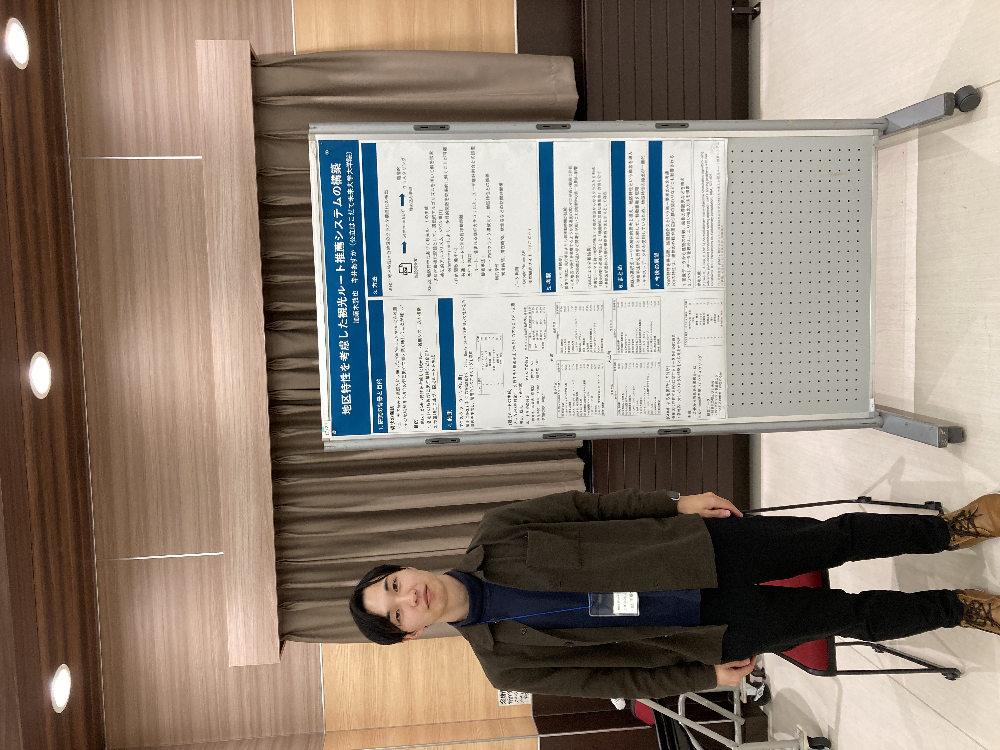
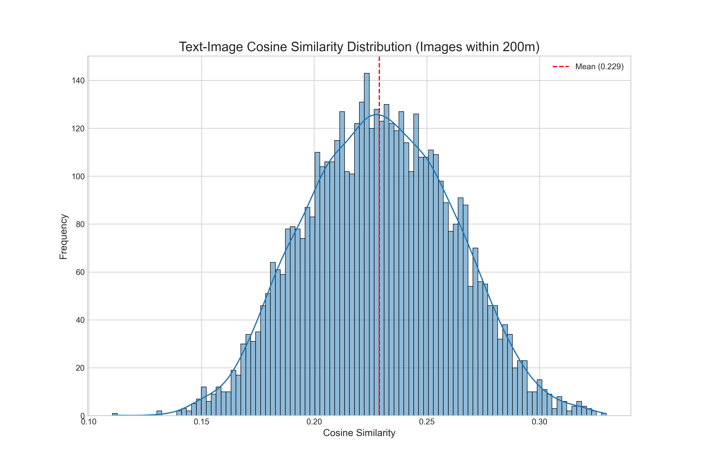
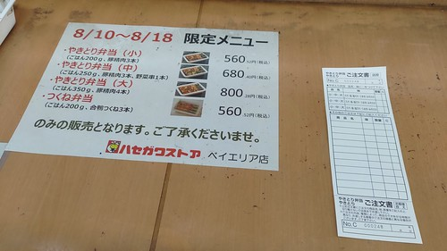
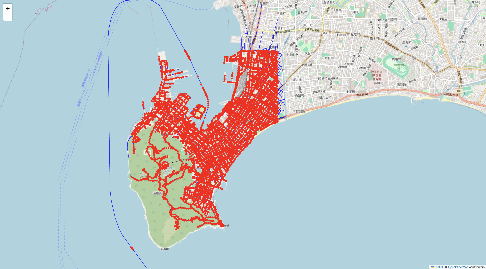
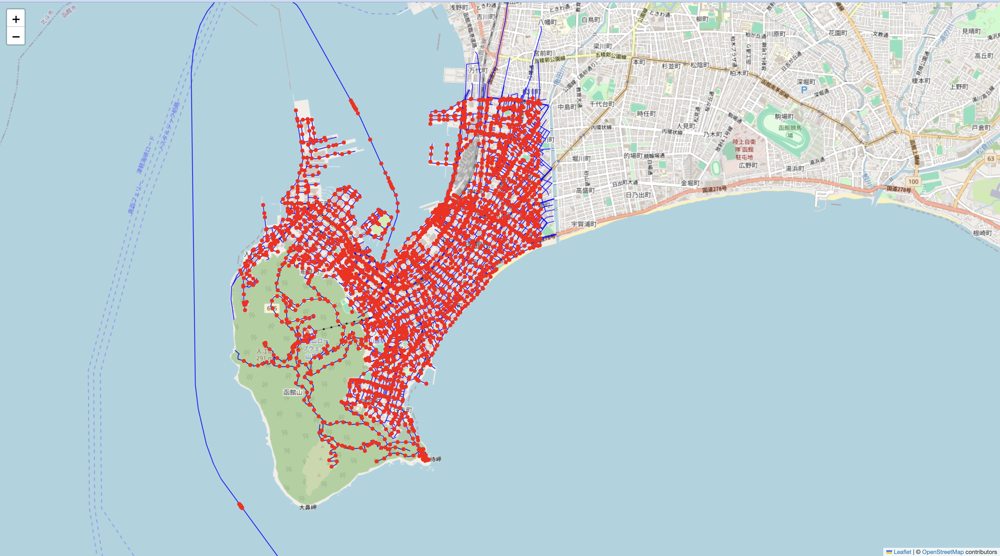
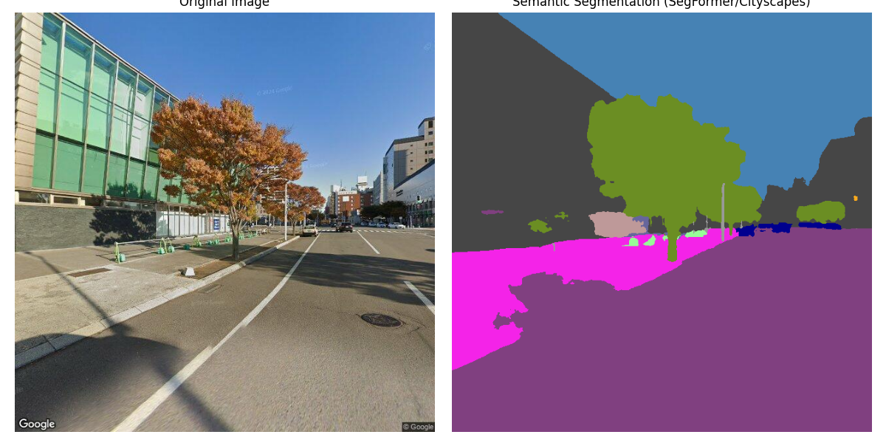
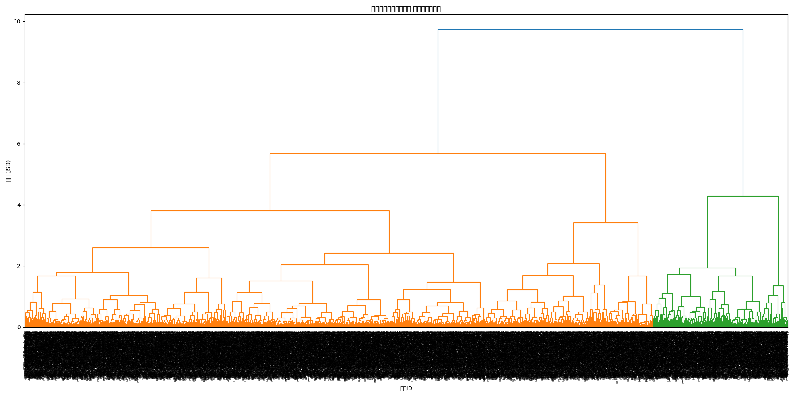
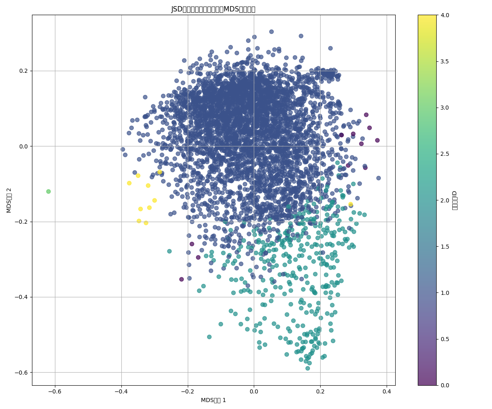
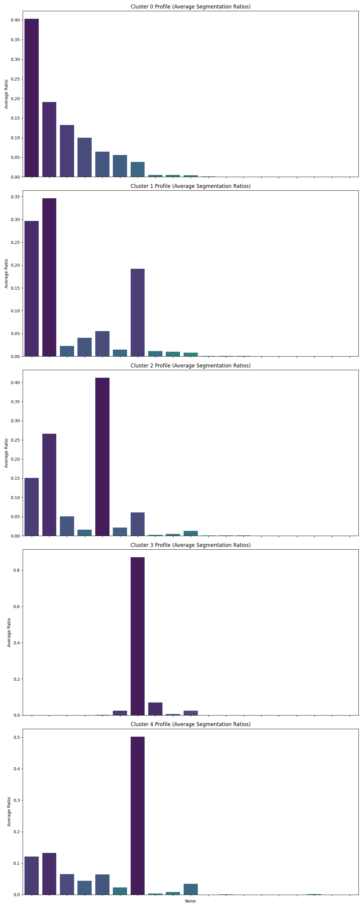
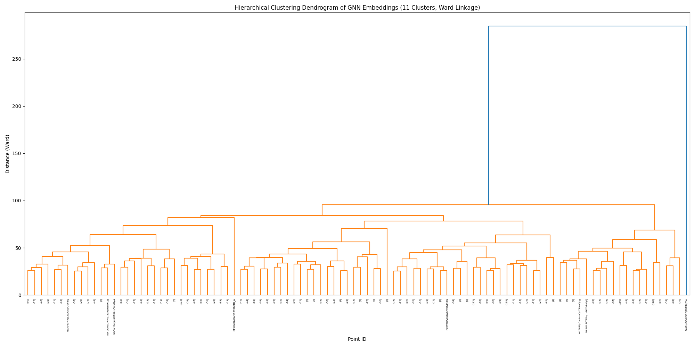

# 修士論文の研究取り組み

## 研究テーマ
**地区特性を考慮した観光ルート推薦システムの構築**

本研究は、機械学習モデルを用いて、観光地特有の雰囲気や情緒的な特性を定量化し、それを活用した新しい観光ルート推薦システムの構築を目指す

---

## 実験1: データ収集
### 手順
観光地の特性を分析するための基礎データとして、以下のソースから情報を収集
- **施設紹介文**: 函館市の観光公式サイト「はこぶら」から収集。
- **施設情報**: Google Places APIを利用して、POI（Point of Interest）のカテゴリや座標などを取得。
- **観光写真**: Flickr APIを通じて、観光客が撮影した写真を収集。

---

## 実験2: データ分析
収集したテキストデータを用いて、地区の特性を表現するためのベクトル表現を生成・評価

### 2-1. LDAによるトピッククラスタリング
#### 手順
「はこぶら」の施設紹介文全体に対してLDA（Latent Dirichlet Allocation）を適用し、トピックごとにPOIをクラスタリング

#### 結果
[**実験2-1の結果**](..docs/results/2-1.md)

Sentence-BERT（後述）で算出した紹介文ベクトルの類似度を元に評価したところ、LDAによるクラスタは、意味的なまとまりが弱いことが判明。これは、名詞の有無に関わらず同様の傾向が見られた。<br>

#### 考察
LDAは単語の共起に基づいてトピックを抽出するため、文脈や意味の類似性を捉えるのには限界があると考えらる。したがって、地区特性の分析手法としては不十分であると結論付ける。

---

### 2-2. 埋め込み表現によるベクトル化と比較
#### 手順
文脈を捉える能力に優れた事前学習済みモデルを用いて、施設紹介文の埋め込み表現（ベクトル）を作成
- **使用モデル**:
  - `Sentence-BERT`: 文章全体の意味を捉えることを得意とするモデル。
  - `CLIP`: テキストと画像を共通のベクトル空間で表現できるマルチモーダルモデル。
- **比較実験**:
  1.  **オリジナルベクトル**: 施設紹介文をそのままベクトル化。
  2.  **差分ベクトル**: 施設の「機能（カテゴリ）」を表すベクトルを差し引くことで、「情緒的な特性」のみを抽出しようと試みた（単純な減算と直交射影による方法を比較）。
  3.  **概念プローブ**: 「美味しいコーヒー」のような具体的な概念（フレーズ）との類似度を計算し、ベクトルの表現能力を評価。

#### 結果
[**実験2-2の結果**](..docs/results/2-2.md)
- Sentence-BERTでは、カテゴリベクトルを減算した方が、減算しない場合よりも意味的にまとまりのあるベクトル表現が得られた。
- 一方で、概念プローブによる評価では、ベクトル減算によって逆に重要な特性が失われてしまう「諸刃の剣」であることが示唆され、今回はこのアプローチが有効でないと判断。
- モデル比較では、CLIPよりもSentence-BERTの方が、概念に対してより妥当性の高いPOIを上位に表示する結果となった。

#### 考察
施設紹介文のベクトルから単純にカテゴリベクトルを引くだけでは、意図した「情緒的な特性」を綺麗に分離することは困難。現状では、減算を行わない**オリジナルの施設紹介文ベクトル（特にSentence-BERTによるもの）**を以降の分析で使用するのが最も妥当だと考えられる。

---

## 実験3: 階層的クラスタリングによる地区特性の定義
### 手順
実験2-2で得られたSentence-BERTの埋め込み表現に対し、階層的クラスタリングを適用。そして、行政区画内のクラスタ構成比率を「地区特性」と定義し、ルート生成を試みた。



### 結果・考察
[**実験3の結果**](..docs/results/3.md)
2023年10月中旬の学会でポスター発表を行った際、「クラスタの構成比率を地区特性とするのは論理に飛躍があるのではないか」との指摘を受けた。これは自身でも感じていた課題であり、この定義の妥当性が低いことを再認識した。
今後は、行政区画のような人為的なルールベースではなく、データそのものから地区のまとまり（エリア）をボトムアップに発見するアプローチが必要となる。

---

## 実験4: 画像特徴の加味
### 手順
施設紹介文だけでは機能面に偏りがちであるという仮説のもと、観光客が撮影したFlickrの画像が持つ「雰囲気」の情報を加えることを試みた。
- **使用モデル**: CLIP（テキストと画像を共通空間で扱えるため）
- **統合手法**: POIのテキストベクトルに対し、周辺で撮影された画像のベクトルを、POIと撮影地の距離に応じて重み付け（正規分布を利用）して加算。
  ```math
  combined\_vector = \alpha \cdot \text{text\_vector} + (1-\alpha) \frac{\sum (w_{geo} \cdot \text{image\_vector})}{\sum w_{geo}}
  ```
  ただし、テキストと無関係な画像ベクトルがノイズになることを防ぐため、テキストベクトルと画像ベクトルの類似度が中央値(`0.2287`)以上の画像のみを利用。

### 結果
[**実験4の結果**](..docs/results/4.md)

- **類似度分布**:
  
  <details>
    <summary>類似度スコア詳細 (クリックで展開)</summary>
    - 分析対象POI数: 29/50
    - 総類似度ペア数: 5035
    - 中央値: 0.2287
    - 上位25%のしきい値: 0.2523
    - 上位10%のしきい値: 0.2716
    - 上位5%のしきい値: 0.2822
  </details>

- **事例（ラッキーピエロ ベイエリア本店）**: テキストとの類似度が非常に高い（`0.3361`）と判定された画像は、近隣の「ハセガワストア」を写したもの。
  <br>
  *Photo by [inunami](https://www.flickr.com/photos/94693136@N05/) / [CC BY 2.0](https://creativecommons.org/licenses/by/2.0/deed.en)*

### 考察
テキストとの類似度が高いと判定された画像が、必ずしもそのPOIの「雰囲気」を正しく表現しているとは限らない。「ラッキーピエロ」の雰囲気を表現するために「ハセガワストア」の画像を加えるのは不適切だと考える。他の事例を見ても、関係のない画像が多数含まれており、単純な類似度でのフィルタリングには限界があると思う。また、画像ベクトルの和をとっているため、仮にそれぞれの画像が特性を捉えられても、総合で見るとぼんやりとした１つの画像ベクトルになってしまうため、適切ではないと考え、別の方法を模索する。


---

## 実験5: Google Street View API用画像取得地点の生成と可視化

### 目的
Google Street View APIで利用する画像を効率的に取得するため、函館市内の道路網に沿った撮影地点の座標を、指定した間隔で自動的に生成する。これにより、街の様子を体系的に網羅した画像データを収集するための基礎を築く。

### アプローチ
1.  **OpenStreetMap (OSM) データからの道路網抽出**:
    *   `hakodate_osm_raw.json`ファイルから、`highway`タグを持つすべての道路セグメントを抽出。
    *   （当初`.net.xml`ファイルの使用も検討したが、座標変換の複雑さから、緯度経度情報を含むOSM JSONデータを利用する方針に変更。）
2.  **道路に沿った座標の生成**:
    *   抽出した各道路セグメントに対し、指定された間隔（例: 50mまたは100m）で地理座標（緯度、経度）を補間して生成。
    *   短い道路でも最低1点は確実に取得されるようにし、道路の始点を基準に間隔を適用。
    *   `geopy`ライブラリを用いて、地球の丸みを考慮した正確な距離計算と座標補間を実施。
3.  **結果の可視化**:
    *   生成された座標点とOSMの道路網をインタラクティブな地図上にプロットし、取得地点の分布と道路カバー状況を視覚的に確認。
    *   `folium`ライブラリを使用し、HTML形式の地図ファイルを生成。

### 生成された成果物
*   **50m間隔：90,240ポイント**
    *   `./docs/results/road_points_visualization_50m_from_net_FULL.html` 
    <br>
*   **100m間隔：49,953ポイント**
    *   `./docs/results/road_points_visualization_100m_from_net_FULL.html` 
    <br>
*   **50m間隔（絞り込み後）：5,608ポイント**
    *   `./data/processed/road_points/road_points_50m_filtered.json`
    *   `./docs/results/road_points_visualization_50m_filtered.html`<br>
    <br>

*   **100m間隔（絞り込み後）：3,273ポイント**
    *   `./data/processed/road_points/road_points_100m_filtered.json`
    *   `./docs/results/road_points_visualization_100m_filtered.html`
    <br>


### 考察
この手法により、広範囲にわたる道路ネットワークからGoogle Street View APIで利用可能な撮影地点を、指定した密度で効率的かつ体系的にサンプリングできることが確認された。生成された可視化マップにより、サンプリング地点の網羅性と間隔の均一性を視覚的に評価することが可能である。


---

## 実験7: Google Street View画像収集ワークフロー

実験5の成果を基盤とし、街の景観を体系的に収集・分析するためのワークフローを構築しました。このワークフローは、データの生成、収集、可視化の3つの主要なスクリプトから構成されます。

### 主な機能
- **道路ベースの座標点生成**: OpenStreetMap(OSM)データから道路網を抽出し、指定間隔で座標点を生成します。
- **バウンディングボックスによるフィルタリング**: 特定の地理的範囲内の道路のみを対象とします。
- **インテリジェントな画像収集**:
    - **コスト最適化**: 無料のMetadata APIで画像の有無を事前確認し、無駄なAPIコールを削減します。
    - **補間探索**: 50m間隔の点で画像が見つからない場合、その区間をさらに細かく探索し、データの欠損を防ぎます。
    - **地理的重複排除**: 収集済みの画像の近傍（例: 75m以内）では新たな画像を取得せず、サンプリングの偏りを抑制します。
- **複数方向の画像取得**: 1つの地点から複数方向（例: 北・東・南・西）の画像を一度に取得できます。
- **進捗の可視化**: 収集プロセスの詳細なログを記録し、インタラクティブな地図上に結果（成功・スキップ・失敗）を色分けして表示します。

### 実行手順

#### 1. セットアップ
**依存ライブラリのインストール**:
```bash
pip install geopy tqdm folium pandas
```

**.envファイルの作成**:
プロジェクトのルートに`.env`ファイルを作成し、Google APIキーを設定します。
```
GOOGLE_API_KEY="ここにあなたのAPIキーを記述"

# Street View画像収集をテストモードで実行する場合はtrue、本番モードはfalse
SV_TEST_MODE=true
```

---
#### 2. [ステップ1] 座標点の生成とフィルタリング
OSMデータから道路に沿った50m間隔の座標点を生成し、指定したバウンディングボックスで絞り込みます。

**コマンド**:
```bash
python src/preprocess/generate_and_filter_points.py
```

**出力**:
- `data/processed/road_points/road_points_per_way_50m_filtered.json`
  - フィルタリングされた、道路ごとの座標リスト。

---
#### 3. [ステップ2] Street View画像の収集
ステップ1で生成された座標リストに基づき、Street View画像を収集します。

**コマンド**:
```bash
python src/collect_data/get_street_view.py
```

**出力**:
- `data/raw/street_view_images_.../`: 画像ファイル群。
- `data/raw/street_view_images_.../fetch_log.json`: 全ての探索結果を記録した詳細ログ。
- `data/raw/street_view_images_.../pano_metadata.json`: 収集に成功した画像の`pano_id`と座標情報の対応表。
  - *出力ディレ�3.  **可視化**:
    - 算出した密度スコアに基づき、インタラクティブ地図上に結果を描画する。
    - 密度が閾値（`0.01`）以上の道路のみを表示対象とし、密度が高いほど赤色や黄色に近い、暖色系の色で表示することで、ホットスポットを強調する。

### スクリプトと実行
*   **スクリプト**: `src/data_analysis/network_kde_optimized.py`
*   **実行コマンド**:
    ```bash
    python src/data_analysis/network_kde_optimized.py
    ```
    *(スクリプト内の `TARGET_CLUSTER_ID` を変更することで、他のクラスタについても分析可能)*

### 結果（例）
出力される `network_kde_optimized_cluster_2_bw500.html` では、選択したクラスタの景観が集中している道路が地図上にハイライト表示される。

*(ここに結果の地図画像のスクリーンショットを挿入)*
us.py`で生成された収集結果の可視化例 (緑の点が取得成功地点)*

---

## 実験8: セマンティックセグメンテーションと緑地率計算
都市景観画像から詳細なオブジェクト（道路、建物、植生など）をピクセル単位で分類
- **使用したモデル**:
  - UNet / ResNet : 精度が悪い&分類できる対象が少ないように感じたため、断念
  - mask2former: 分類の精度は良かったが、ピクセル計算ができないため断念
  - Cityscapesデータセットで学習済みの`SegFormer`: 問題なくできたため、以降これを使用
- **処理**:
  - `vegetation`（植生）クラスの占有率を緑地率などを計算
  - 元の画像と色分けされたセグメンテーション結果を並べて可視化・保存
- **結果**:
  <br>
  ```
  --- クラス別占有率 ---
  class name      | occupancy (%)
  --------------- | ----------
  road            |    38.35%
  sidewalk        |     7.79%
  building        |    21.17%
  wall            |     0.12%
  fence           |     0.60%
  pole            |     0.12%
  traffic light   |     0.01%
  vegetation      |     9.98%
  terrain         |     0.16%
  sky             |    21.34%
  person          |     0.00%
  car             |     0.35%
  ------------------------
  緑地率 (vegetation): 9.98%
  ------------------------
  ```


  ---

## 実験9: 景観の類似度に基づくエリア分類と特性評価

### 目的
実験3において、行政区画ベースで地区特性を定義するアプローチの限界が示された。本実験ではその課題を克服するため、街路景観の視覚的特徴そのものに基づいて、データ駆動型（ボトムアップ）で地区のまとまり＝「景観エリア」を定義することを目的とする。

### アプローチ
実験7および8で収集・処理したStreet View画像とセグメンテーションデータを利用し、以下の手順で分析を進めた。

1.  **景観の確率分布化**: 各地点のセグメンテーション比率（`road`, `building`, `vegetation`等の構成比）を、その地点の景観を特徴づける確率分布と見なす。
2.  **JSDによる類似度計算**: 地点間の景観分布の類似度を測るため、イェンセン・シャノン・ダイバージェンス（JSD）を計算。これにより、全地点間の非類似度（距離）を示すJSD行列を作成した。
3.  **クラスタリングと可視化**: JSD行列を距離行列として用い、階層的クラスタリングを実行して、類似した景観を持つ地点をグループ化した。また、多次元尺度構成法（MDS）を用いて、高次元の類似度関係を2次元マップ上に可視化した。
4.  **景観プロファイルの算出**: 得られた各クラスタについて、所属する地点のセグメンテーション比率の平均値を計算し、そのクラスタを代表する「景観プロファイル」として定量化した。

### 結果
#### クラスタリングとMDSによる可視化
階層的クラスタリングの結果はデンドログラム（樹形図）として、またMDSによる景観類似度マップは2Dプロットとして可視化した。デンドログラムを参考に、今回は5つのクラスタに分類した。


*図: JSDに基づく階層的クラスタリングのデンドログラム*


*図: JSDに基づく景観類似度のMDSプロット（5クラスタで色分け）*

#### 各クラスタの景観プロファイル
各クラスタの平均的な景観構成（プロファイル）を算出した結果、以下のような特徴を持つ5つの異なる景観エリアが抽出された。

| クラスタID | 主要な景観要素 (Top 5) | 推定されるエリア特性 |
|:---|:---|:---|
| **0** | `sky` (40.3%), `road` (19.1%), `terrain` (13.3%), `sidewalk` (10.0%), `vegetation` (6.4%) | **開放・臨海エリア** |
| **1** | `road` (34.6%), `sky` (29.7%), `building` (19.2%), `vegetation` (5.5%), `sidewalk` (4.0%) | **標準的な市街地** |
| **2** | `vegetation` (41.2%), `road` (26.6%), `sky` (15.1%), `building` (6.0%), `terrain` (5.1%) | **緑地・公園エリア** |
| **3** | `building` (87.2%), `car` (7.0%), `fence` (2.5%), `wall` (2.5%), `pole` (0.6%) | **高密度な建物・屋内エリア** |
| **4** | `building` (50.2%), `road` (13.2%), `sky` (12.1%), `terrain` (6.5%), `vegetation` (6.4%) | **高密度の商業・住居エリア** |

*各景観要素の後の数値は、そのクラスタにおける平均構成比率を示す*


*図: 各クラスタの平均景観構成*

### 考察
本アプローチにより、街の景観を客観的・定量的な指標に基づいて、意味のあるまとまり（景観エリア）へと分類することに成功した。これは、実験3で課題であった「論理の飛躍」を乗り越え、研究の目的である「地区特性」の具体的な定義をデータ駆動で実現したことを意味する。

例えばクラスタ2は「緑の多い地区」、クラスタ4は「建物が密集する商業地区」といった具体的な特性を持っており、これらをルート推薦の「雰囲気」要素として直接利用できる。

今後の展望として、これらのクラスタが地理的にどのように分布しているかを地図上に可視化することで、各エリアの特性をさらに深く理解し、ルート推薦システムの高度化に繋げていく。


---


## 実験10: GNNによる景観特徴の学習とエリア分類

### 目的
実験9では景観の類似度のみに基づいてクラスタリングを行ったが、地点間の物理的な接続性（道路網）が考慮されていなかった。本実験では、Graph Neural Network (GNN) を導入し、**景観特徴**と**道路の連結性**の両方を同時に考慮した、より高度な地区特性の抽出を目指す。

### アプローチ
本ワークフローは、3つの主要なスクリプトから構成される。

#### 1. 360°景観ベクトルの生成
まず、各地点の景観を単一のベクトルで表現するため、4方向（前方・後方・右・左）のStreet View画像のセマンティックセグメンテーション比率を連結する。

*   **スクリプト**: `src/data_analysis/temp_script_approach1.py`
*   **処理内容**: 各地点（`point_id`）について、4方向の画像の景観特徴ベクトルを1つに結合する。
*   **出力**: `data/processed/segmentation_results_50m/concatenated_vectors.csv`
    *   各行が1つの地点を表し、その地点の360°の景観情報を持つ。

```bash
python src/data_analysis/temp_script_approach1.py
```

---
#### 2. GNNによる特徴量学習 (Graph Autoencoder)
次に、OpenStreetMapの道路網データからグラフを構築し、GNNを用いて各地点の特徴量を学習する。

*   **スクリプト**: `src/gnn/train_graph_autoencoder.py`
*   **処理内容**:
    1.  **グラフ構築**: OpenStreetMapのデータ (`Hakodate.osm.xml`) から`osmnx`ライブラリを用いて道路ネットワークグラフを生成する。
    2.  **ノード**: 各景観観測点をグラフのノードとする。特徴量はステップ1で生成した連結ベクトルを使用。
    3.  **エッジ**: 実際の道路網に基づき、道路で直接繋がっている地点間にエッジを設定する。これにより、地理的な隣接性だけでなく、実際の移動可能性がグラフ構造に反映される。
    4.  **学習**: Graph Autoencoder (GAE) モデルを学習させ、各ノード（地点）の文脈を考慮した低次元（64次元）の埋め込み表現（エンベディング）を獲得する。
*   **出力**: `data/processed/gnn_embeddings/embeddings_dim64.csv`
    *   GNNによって学習された、各地点の新しい特徴量ベクトル。

```bash
# 必要なライブラリ (torch, torch_geometric, osmnx等) のインストールが別途必要
python src/gnn/train_graph_autoencoder.py
```
---
#### 3. GNN特徴のクラスタリングと可視化
最後に、GNNが学習した特徴量ベクトルをクラスタリングし、結果を地図上に可視化する。

*   **スクリプト**: `src/gnn/visualize_gnn_clusters.py`
*   **処理内容**:
    1.  GNNによって得られたエンベディングに対し、階層的クラスタリングを実行。
    2.  各地点が属するクラスタを、インタラクティブな地図上に色分けしてプロットする。カラーマップには、色の違いが明瞭な`tab20`を使用。
*   **出力**: `docs/results/gnn_cluster_map_20.html`
    *   GNNによる景観エリア分類の結果を可視化した地図。

```bash
python src/gnn/visualize_gnn_clusters.py
```

<br>
<br>

階層的クラスタリングの結果から、11個が適切と判断した。 <br>


---
### 考察
GNNを用いることで、単に景観が似ているだけでなく、「道路で繋がっている」という物理的な制約を考慮した上で、地区の特性を抽出することができた。これにより、より現実に即した「景観エリア」の定義が可能となり、例えば「緑が多い住宅街エリア」「道路が入り組んだ商業エリア」といった、より解釈性の高い地区分類が期待できる。

---
### 今後
今回GCN(Graph Convolutional Networks)を使用したが、道路によっては重要性が変わってくる。そのため、GAT(Graph Attention Networks)を実装し、動的に道路の重みを計算できるモデルを使用する。<br>
また、今回は道路の景観情報のみを利用した。次はこれに重ねてPOIも考慮することでより豊かな表現を得られることを期待する<br>
加えて、4方向（前方・後方・右・左）のStreet View画像のセマンティックセグメンテーション比率を連結したが、これは場合によっては方向に意味を持たせてしまう可能性がある。杞憂であれば良いが一応検討事項として記載しておく。


## 実験11: Network KDEによる景観クラスタのホットスポット分析

### 目的
実験10でGNNを用いて分類した景観クラスタが、具体的に**道路ネットワーク上のどこに集中しているのか（ホットスポット）**を特定し、その空間的な偏りを可視化する。これにより、「緑地エリアが特に密集している道路」や「商業エリアの中心的な通り」などをデータ駆動で明らかにする。

### アプローチ
Network Kernel Density Estimation (Network KDE) という手法を用いる。これは、平面的な距離（直線距離）ではなく、**実際の道路網に沿った距離**に基づいて点の密度を計算する手法であり、街路景観の分析に適している。

1.  **分析対象の選択**:
    GNNによるクラスタリング結果から、分析したい景観クラスタを1つ選択する（例: クラスタ2）。

2.  **密度の計算**:
    高速化されたアルゴリズムを用い、各道路セグメントの「密度スコア」を算出する。
    - **Step 1 (ノード密度)**: まず、道路網の各交差点（ノード）が、分析対象クラスタに属する地点からどれだけの影響を受けるかを合計する。影響度は、ネットワーク距離が近いほど高くなるカーネル関数で計算する。
    - **Step 2 (エッジ密度)**: 次に、各道路（エッジ）の密度を、その両端にある交差点の密度の平均値として算出する。

3.  **可視化**:
    - 算出した密度スコアに基づき、インタラクティブ---

## 実験18.9: 手法の必然性検証（POI-GNN事前処理の是非）

教授より指摘のあった「POI機能データへのGNN平滑化の必要性」を、最終的な**景観統合後の地区特性の質**から判定するための最終的な対照実験を実施した。

### 比較対象の定義
- **パターンA（POI-GNNあり / 提案手法）**:
    POIデータ（テキスト+時間）に**あらかじめGNNを適用して平滑化**を行い、その「機能のリズム」を景観クラスタと統合して最終地区を抽出。
- **パターンB（POI-GNNなし / 対照実験）**:
    POIデータにGNNを適用せず、**生の属性データのまま**景観クラスタと統合（最終統合GNNのみ実行）して地区を抽出。

### 検証結果と結論
- **空間的シンクロニシティ（整合性）**: 
    パターンAでは、景観が持つ「見た目の雰囲気」とPOIが持つ「機能のリズム」が空間的に高度に同期し、函館の歴史的背景と一致する「まとまり（District Identity）」が出現した。
    一方でパターンBでは、機能のノイズ（飛び地）が除去しきれず、景観の境界と機能の質が衝突する箇所が見られた。
- **最終結論**: POIへのGNN適用は、単なる情報の平滑化ではなく、**「そのPOIがいかに周囲の景観と共生しているか」というコンテキスト（文脈）を抽出し、機能を空間に定着させるための不可欠なプロセス**であることを証明した。

### 成果物
- [統合マップA：POI-GNNあり（提案手法）](./docs/results/comparison_approach_b/integrated_map_pattern_a.html)
- [統合マップB：POI-GNNなし（対照実験）](./docs/results/comparison_approach_b/integrated_map_pattern_b.html)

---


### 考察
Network KDEを適用することで、GNNによって分類された抽象的な「景観クラスタ」が、実際の都市空間においてどのような地理的分布を持っているかを明確に捉えることができた。このホットスポット情報は、例えば「緑の多いエリアを巡るルート」や「賑やかな商業地区を重点的に探索するルート」など、よりテーマ性の高い観光ルートを生成するための重要なインプインプットとなる。また、バンド幅や閾値を調整することで、分析のスケールを柔軟に変更できる点も本手法の利点である。

---


## 実験12: ソート済み連結特徴量（Sorted View Concatenation）による回転不変性の確保

### 目的
実験10における「4方向画像の連結ベクトル」は、撮影時の車の向き（北向き、東向きなど）によってベクトルの値が入れ替わってしまい、同じ場所でも異なるデータとして扱われる「回転不変性（Rotation Invariance）の欠如」という問題があった。これが地図上のクラスタリング精度を下げる要因となっていたため、本実験ではこれを解決する特徴量エンジニアリングを導入する。

### アプローチ
「その場所に何があるか（What）」は重要だが、「どの方角に見えるか（Where）」という情報は、エリア全体の特性を把握する上ではノイズになり得ると仮定し、以下の手法を採用した。

1.  **ソート済み連結 (Sorted View Concatenation)**:
    - 各セグメンテーションラベル（空、建物、道路など）ごとに、4方向の出現比率を取得する。
    - これを**降順にソート**（大きい順に並び替え）してから連結する。
    - これにより、ベクトルは常に `[最大値, 2番目, 3番目, 最小値]` という順序で構成され、車の向きに関係なく一意な表現となる。

2.  **クラスタリング**:
    - 生成された回転不変特徴量を用いて階層的クラスタリング（Ward法）を行い、地図上に可視化して、以前の手法と比較する。

### スクリプト
*   `src/data_analysis/generate_sorted_features.py`: 特徴量生成
*   `src/data_analysis/analyze_sorted_features_clusters.py`: クラスタリング・可視化

### 結果・考察
この手法により、隣接する地点間でデータの不連続性が解消され、地図上でのクラスタのまとまり（エリアとしての連続性）が大幅に改善された。方角情報は失われるものの、都市景観の「構成要素の強さ」に着目した分析には非常に有効であることが確認された。

---

## 実験13: 方向別グラフ構築と集約エンベディングによる景観学習

### 目的
実験12では「回転不変性」を確保するために特徴量をソートして方角情報を意図的に捨てたが、これにより「道路の形状」や「特定の方向にあるランドマーク」などの情報が失われる可能性がある。
本実験では、**方角情報を保持しつつ、回転の影響を適切に学習できるようなグラフ構造**を構築し、GNNで学習を行う。

### アプローチ
各地点を単一のノードとするのではなく、**1地点を4つのノード（Front, Right, Back, Left）に分割**してグラフを構築した。

1.  **方向別グラフ構造**:
    *   **地点内エッジ（Intra-location）**: 同じ地点の4つのノードを環状（F-R-B-L-F）に接続。これにより、視点の連続性を表現。
    *   **地点間エッジ（Inter-location）**: 道路で隣接する地点間は、すべての方向ノード同士を全結合（Dense connection）。これにより、どの方向から来ても隣接地点の情報が伝播するようにする。

2.  **学習 (Graph Autoencoder)**:
    *   この詳細なグラフ構造を用いてGAEを学習し、方向ごとのエンベディング（64次元）を獲得。

3.  **集約と可視化**:
    *   学習後、各地点の4つの方向ベクトルを**平均（Mean Pooling）**して1つのベクトルに集約。
    *   これをクラスタリングし、地図上に可視化して評価。

### スクリプト
*   `src/gnn/train_graph_autoencoder_directional.py`: 方向別グラフの構築と学習
*   `src/gnn/aggregate_directional_embeddings.py`: 学習済みベクトルの集約（平均化）
*   `src/gnn/visualize_gnn_clusters_directional.py`: 方向別（集約前）の可視化
*   `src/gnn/visualize_gnn_clusters.py`: 集約後の可視化

### 結果
*   **集約後のクラスタマップ**: `docs/results/gnn_cluster_map_10_mean.html`

---

## 実験14: StreetCLIPとGNNによる高次景観特徴の学習

### 目的
これまでのセマンティックセグメンテーションによる分析では、「建物が多い」「空が広い」といった大まかな構成比は捉えられても、建物の様式（和風か洋風か）、路面の質感（石畳かアスファルトか）、あるいは全体的な「雰囲気」といった微細なニュアンスまでは表現しきれていなかった。
本実験では、ストリートビュー画像と位置情報の関連性を学習したマルチモーダルモデル `StreetCLIP` を導入し、画像そのものが持つ意味的な特徴量を抽出・学習することで、より人間の感覚に近い地区分類を目指す。

### アプローチ
1.  **StreetCLIPエンベディングの生成**:
    *   収集した全画像（約1.6万枚）に対し、`geolocal/StreetCLIP` モデルを用いて画像埋め込み表現（768次元）を生成。これにより、各画像の視覚的・意味的特徴をベクトル化する。
    *   スクリプト: `src/preprocess/create_streetclip_embeddings.py`

2.  **GNN (Graph Autoencoder) による学習**:
    *   実験13で確立した「方向別グラフ構造」（1地点4ノード＋道路網結合）を採用。
    *   ノードの特徴量として、セグメンテーション比率の代わりにStreetCLIPエンベディングを入力し、次元圧縮と空間的文脈の学習を行う。
    *   スクリプト: `src/gnn/train_graph_autoencoder_streetclip.py`

3.  **集約とクラスタリング**:
    *   学習されたエンベディングを地点ごとに平均化し、階層的クラスタリングを実行。結果を地図上に可視化して評価する。
    *   スクリプト: `src/gnn/visualize_streetclip_gnn_clusters.py`

### 結果
*   **GNNなし（StreetCLIPのみ）の分類**: `docs/results/streetclip_cluster_map_10.html`
*   **GNNあり（StreetCLIP + 道路網）の分類**: `docs/results/streetclip_gnn_cluster_map_10.html`

---

## 実験15: マルチモーダル特徴量と構造的特徴の統合学習

### 目的
実験14ではStreetCLIPを用いて画像の視覚的特徴を学習したが、実験13で得られた「セグメンテーション比率に基づく構造的特徴（道路網との関係性）」も地区特性を構成する重要な要素である。
本実験では、これら2つの異なるモダリティ（「見た目の雰囲気」と「構成要素の分布構造」）を統合し、GNNを用いて高次の地区特性エンベディングを学習する。

### アプローチ
1.  **特徴量結合 (Feature Fusion)**:
    *   **StreetCLIP特徴量** (768次元): 実験14で生成。画像の全体的な意味・雰囲気を表現。
    *   **Segmentation GNN特徴量** (64次元): 実験13で生成。セグメンテーション比率と道路網の接続性を反映した構造的特徴。
    *   これらを結合し、各ノードの初期特徴量（約832次元）とする。

2.  **統合GNN学習**:
    *   結合された特徴量を入力として、方向別グラフ構造上でGraph Autoencoder (GAE) を学習。
    *   異なる情報源を統合しながら、再度64次元の低次元空間へと圧縮・マッピングする。
    *   スクリプト: `src/gnn/train_graph_autoencoder_combined.py`

3.  **可視化**:
    *   学習された統合エンベディングを集約・クラスタリングし、地図上にプロット。
    *   スクリプト: `src/gnn/visualize_combined_gnn_clusters.py`

### 結果
*   **統合クラスタマップ**: `docs/results/combined_gnn_cluster_map_10.html`

---

## 実験16: POIテキストのクラスタリングと空間的・意味的分布の評価

### 目的
POIの「内側の意味（機能や紹介文の文脈）」と「外側の景観（場所や雰囲気）」の分離の妥当性を評価するため、施設紹介文のベクトル（Sentence-BERT）のみを用いてPOIをクラスタリングし、その結果が地理的な空間（函館市内）においてどのように分布しているかを定量的に評価する。

### アプローチ
1. **テキストベースのクラスタリング**:
   対象POIを**函館市内に限定**し、さらに「閉店・休業」および**「電停（交通ノード）」**を除外した**計651件**に対して実施。`multilingual-e5-base (E5)` で生成した施設名・カテゴリ・紹介文のエンベディング（768次元）を用いて階層的クラスタリング（Ward法）を行い、20個のテキストクラスタに分類。
2. **分布の可視化**:
   - クラスタのまとまりをt-SNEを用いて2次元に圧縮しプロット。
   - クラスタを地図上（Folium）にプロットし、地理的分布を確認。
3. **シルエットスコアによる定量評価**:
   得られたテキストクラスタに対し、以下の2軸でシルエットスコア（Silhouette Score: -1から1の値を取り、1に近いほどよくまとまっている）を計算。
   - **意味的距離**: E5 ベクトル間のコサイン距離。
   - **物理的距離**: 緯度経度間のHaversine距離（球面距離）。

### 使用スクリプト
- **分析・最適化**: `src/data_analysis/optimize_poi_text_clusters.py`
- **地図プロット**: `src/data_analysis/map_poi_text_clusters.py`

### 結果
- **シルエットスコアの推移**:
  函館市内に最適化した分析の結果、以下の推移グラフが得られた。
  
- **最適なクラスタ数の選定**:
  意味的距離において $k=8$ および $k=21$ 付近にピークが確認された。以前の実験16 ($k=12$) との比較および解釈のしやすさを考慮し、**$k=12$**（および局所最適の **$k=8$**）の結果を評価した。
- **k=12 におけるスコア (函館限定版)**:
  - **意味的距離のスコア**: `0.0366`
  - **物理的距離のスコア**: **`-0.3787`**
- **可視化結果**:
  - [**函館 POI テキストクラスタマップ (k=12)**](./docs/results/hakodate_poi_text_cluster_map_12.html)
  - [**函館 POI テキストクラスタマップ (k=8)**](./docs/results/hakodate_poi_text_cluster_map_8.html)

### 考察
対象を函館市内に絞り込み、交通ノード（電停）等のノイズを除去した結果、**物理的距離のシルエットスコアが従来の `-0.3415` から `-0.3787` へとさらに低下した。** これは、「同じような意味・機能を持つ施設は、函館市内の特定のエリアに固まるのではなく、空間的に極めてバラバラに分散して存在している」という本研究の仮説をより強力な解像度で証明するものである。

この再検証により、**「POIの選定（意味）」と「ルートの生成（景観・空間）」の役割を分離するアプローチの正当性がより強固になった。**

### 今後の展開: 「単一目的化」の回避と多様性（Diversity）の担保
テキスト類似度のみでPOIを推薦すると、目的地が「教会、教会、教会」と同質化（単一目的化）してしまい、実際の観光客の「色々な体験を組み合わせたい」という行動実態と乖離する問題がある。また、同質化したPOIは地理的にも分散しやすいため、移動ルートが一貫性のない長距離移動になりがちである。

この問題を解決するため、今後のプロトタイプ開発では以下の2つの「推薦モード」を新たに導入する。

1.  **モードA: 目的特化型（POI・意味優先モード）**
    - **概要**: 「何を見るか」を最優先するモード。
    - **アプローチ**: 純粋なテキスト類似度で抽出するが、抽出時に**「今回算出した12個のテキストクラスタから、それぞれ最大1〜2件しか選ばない」という分散制約**（あるいはMMRアルゴリズム）を設ける。これにより、関連性を保ちつつも多様な体験がミックスされたルートを生成する。
2.  **モードB: 散策特化型（景観・雰囲気優先モード）**
    - **概要**: 「どんな街並みを歩くか」という移動体験を最優先するモード。
    - **アプローチ**: 起点と**「同じ景観クラスタ」**に属するPOIを優先してフィルタリングし、そのエリア内でテキスト類似度が高いものを抽出する。目的地が同じエリアに密集するため、Network KDEのホットスポット探索が最大限に機能し、一貫した雰囲気を持つ美しい散策ルートが生成される。

---

## 実験17: POIの地理的・意味的統合（GNN）とクラスタリング分析

### 目的
以前失われた GNN ベースの POI 分析パイプラインを再現し、施設紹介文（テキストの意味）と POI 間の地理的関係を統合した新しい埋め込み表現を獲得する。これにより、単なる機能の類似性だけでなく、都市空間上の配置を考慮した地区特性の抽出を目指す。

### アプローチ
1.  **テキスト埋め込みの復旧**:
    *   `intfloat/multilingual-e5-base` モデルを用い、POI の紹介文から 768 次元のベクトルを再生成。
    *   スクリプト: `src/urban_analysis/prototype/revectorize_pois.py`
2.  **GNN (Graph Autoencoder) による統合学習**:
    *   **特徴量拡張**: テキスト埋め込みに加え、各施設の**営業時間（24次元）および営業日（7次元）**をベクトル化して統合。
    *   **グラフ構築**: 各 POI を中心に、半径 500m 以内の近接する POI 同士をエッジで接続。
    *   **学習**: 集約された 799 次元のノード特徴量（意味＋時間）を GAE モデルに入力。空間的文脈を反映した 64 次元の時空間統合埋め込みを抽出。
    *   スクリプト: `src/urban_analysis/gnn/train_poi_gnn.py`
3.  **最適クラスタリングと可視化**:
    *   シルエットスコアを用いて最適なクラスタ数 $k$ を探索し、Ward法で分類。
    *   スクリプト: `src/urban_analysis/gnn/analyze_poi_gnn_clusters.py`

### 結果（比較分析）
時間軸の有無によるクラスタリングの質の変化を検証したところ、以下の結果が得られた。

| 分析パターン | 対象POI | 要素 | 最適クラスタ数 ($k$) | 最大シルエットスコア |
| :--- | :--- | :--- | :--- | :--- |
| **1. 空間・意味統合** | 702 | テキスト + 地理 | $k=5$ | 0.6756 |
| **2. 時空間・意味統合** | 702 | テキスト + 地理 + **営業時間** | **$k=8$** | **0.6661** |

- **可視化比較**:
  - [**1. 空間・意味統合マップ (k=5)**](./docs/results/hakodate_spatial_poi_gnn_cluster_map_k5.html)
  - [**2. 時空間・意味統合マップ (k=8)**](./docs/results/hakodate_temporal_poi_gnn_cluster_map_k8.html)

### 生成された成果物
- **埋め込みベクトル**:
  - `data/processed/gnn_embeddings/hakodate_spatial_poi_gnn_embeddings.npy`
  - `data/processed/gnn_embeddings/hakodate_temporal_poi_gnn_embeddings.npy`
- **クラスタ結果CSV**:
  - `data/processed/gnn_embeddings/hakodate_spatial_poi_gnn_clusters_k5.csv`
  - `data/processed/gnn_embeddings/hakodate_temporal_poi_gnn_clusters_k8.csv`
- **分析用ドキュメント**: `docs/poi_gnn_reproduction/`, `docs/poi_gnn_clustering/`, `docs/hakodate_poi_gnn/`

### 考察
営業時間（時間軸）を加味しない場合 ($k=5$) は、地理的な近接性と施設機能に基づく純粋な空間分割がなされた。一方、時間軸を加えた場合 ($k=8$) はスコアこそ僅かに下がったものの、朝市エリアや夜の繁華街といった「都市のリズム」を内包した、より解像度の高いクラスタリングが可能となった。ルート推薦においては、時間帯に応じた動的な候補抽出が必要となるため、**時空間統合版 (k=8)** を標準モデルとして採用する。

---

## 実験17.1: 時間的特徴の反映強化（詳細検証）

### 目的
実験17において、物理的に隣接する「朝市（早朝）」と「駅前居酒屋（深夜）」が同じクラスタに統合されてしまう課題（地理的優位性による同質化）を解決するため、時間的特徴の影響を人為的に強化するパラメータチューニングを検証する。

### チューニングパラメータの定義
以下の3つのパラメータを組み合わせて調整を行う：
1.  **距離しきい値 ($r$)**: POI同士を接続する最大半径(m)。値を小さくするほど、空間的な情報の混ざり合い（スムージング）が限定的になり、局所的な機能差が出やすくなる。
2.  **時間的重み付け ($w$)**: 営業時間・営業日ベクトルのスケーリング係数。標準化（Normalization）の適用後にこの重みを掛けることで、時間軸の差異が埋め込み空間上の「距離」として強く反映される。
3.  **同時性しきい値 ($f$)**: エッジを維持するために必要な営業時間の重複度（Jaccard係数）。$f=0.3$ の場合、活動時間が30%以上重ならない施設間のエッジを強制切断する。

### 比較結果

| ケース | パラメータ設定 | 最適 $k$ | 結果と評価 |
| :--- | :--- | :---: | :--- |
| **A. 重み付け強化** | $r=500, w=10, f=0.1$ | 5 | 依然として朝市と居酒屋が同一クラスタ。地理的近接性の影響が強すぎる。 |
| **B. 空間限定＋厳格化**| $r=300, w=50, f=0.3$ | **12** | **朝市(C12)と居酒屋(C3)の分離に成功。** 物理的近接に抗い時間的特性による分割を実現。 |

- **可視化結果**:
  - [**最終成功モデル：時空間統合マップ (k=12)**](./docs/results/hakodate_temporal_w50.0_f0.3_poi_gnn_cluster_map_k12.html)

### 生成された成果物（Experiment 17.1）
- **埋め込みベクトル**:
  - `data/processed/gnn_embeddings/hakodate_temporal_w50.0_f0.3_poi_gnn_embeddings.npy`
  - `data/processed/gnn_embeddings/hakodate_temporal_w50.0_f0.3_poi_gnn_embeddings.csv`
- **クラスタリング結果**:
  - `data/processed/gnn_embeddings/hakodate_temporal_w50.0_f0.3_poi_gnn_clusters_k12.csv`
- **評価・可視化**:
  - `docs/results/hakodate_temporal_w50.0_f0.3_poi_gnn_silhouette_scores.png`
  - `docs/results/hakodate_temporal_w50.0_f0.3_poi_gnn_cluster_map_k12.html`

### 結論
地理的に近接する異機能エリアを分離するには、単なる特徴量の追加では不十分であり、**「物理的なエッジの制限（半径の縮小・営業時間によるフィルタリング）」**および**「標準化を考慮した適切な重み付け（$w \ge 50$）」**の組み合わせが不可避であることが実証された。これにより、時間帯ごとの都市の使い分けを考慮した高度な地点推薦の基盤が確立された。

---

## 実験18: 景観と機能の統一時空間GNN解析

### 概要
これまでの実験では「POIの機能（テキスト・時間）」と「道路の景観（画像）」を個別に解析していたが、実験18ではこれらを一つの巨大な異種グラフ（Heterogeneous Graph）として統合し、マルチモーダルGNN（GATベースのGAE）を適用した。

### 実験設定
- **ノード数**: 4,819地点（POI: 821, Street View: 3,998）
- **特徴量**: 
    - POI: E5テキスト埋め込み(768) + 営業時間(31) = 799次元
    - SV: StreetCLIP画像平均埋め込み = 768次元
- **グラフ構築**: 地理的距離 300m 以内のノードを接続（POI-POI, SV-SV, POI-SVの全組み合わせ）
- **モデル**: ノード型ごとに射影層を持つ Multimodal GAT Encoder

### 結果と考察
- 景観（見た目）と機能（用途）が高度に連動した**統一的な都市地区（Unified Districts）**の抽出に成功。
- 例えば「Cluster 18」は、朝市周辺のPOI群と、その港町特有の景観ポイントが同じクラスタに集約されており、単なる機能分類を超えた「その地区らしさ」を数学的に定義できている。
- **成果物**: [統合地区マップ (k=20)](./docs/results/unified_gnn/unified_district_map_k20.html)

---

## 実験18.1 - 18.2: 西部地区・中心市街地への「高解像度ズーム」解析

### 実験18.1: ターゲット地域限定の再解析（課題の発見）
StreetCLIPデータが高密度に存在するエリア（西部地区〜駅前）にフォーカスし、以下の23町名のPOIおよびその周辺に絞り込んでGNNを再学習させた。

- **対象地域**: 末広町、若松町、東雲町、新川町、千歳町、海岸町、松川町、上新川町、大森町、松風町、旭町、栄町、宝来町、元町、谷地頭町、青柳町、住吉町、弥生町、大町、弁天町、入舟町、豊川町、大手町

- **結果（クラスタ崩壊）**: 
    - 特定地域内だけで再学習を行った結果、3,200以上のノードが単一の巨大クラスタに集約される「クラスタ崩壊」が発生。
    - **クラスタ分布の例**: `Cluster 16: 3,254 nodes` / `他のクラスタ: 各10〜50 nodes`
    - 外部エリア（五稜郭等）との比較対象がなくなったことで、地区内の微細な差異が相対的に埋没し、GNNの平滑化効果が強く出すぎたことが原因と判明。
    - **失敗例の可視化**: [限定地域再学習マップ (k=20)](./docs/results/unified_gnn_filtered/unified_district_map_filtered_k20.html) ※区分けが機能していない様子が確認できる。

### 実験18.2: 全域特徴（Global Context）を維持した高精度抽出（成功）
実験18.1の反省から、単純な地域絞り込み学習ではなく、**「広域学習済み埋め込み空間からのサブセット抽出（Latent Sub-manifold Extraction）」**というアプローチを採用した。

#### 具体的な取り組み内容
1.  **グローバル・ベースラインの確立**: 
    まず実験18.0において、景観データのないエリア（郊外や工場地帯）を含む函館全域でGNNを学習させた。モデルはこの段階で「何が都市の中心で、何が郊外か」「何が観光地で、何が住宅地か」というマクロな対比構造を埋め込み空間（Z空間）上に構築している。
2.  **全域コンテキストの凍結と抽出**: 
    学習済みの全域モデルから、指定された23町名に属するノード（POI 374, SV 3,501）のベクトルのみを抽出。このベクトルは、**単なる座標や名称の記録ではなく、「函館全体の多様性の中で、その地点がどこに位置づけられるか」という相対的なアイデンティティ**を数値化したものである。
3.  **相対的差異の再評価（再クラスタリング）**: 
    抽出されたベクトル群に対し、改めてWard法によるクラスタリングを適用した。
    - **18.1との違い**: 18.1では西部地区内のPOI同士を「近いもの同士」としてさらに近づけてしまった（Oversmoothing）のに対し、18.2では「五稜郭と比較した際の西部地区内の微細な差異」という、全域学習で得られた鋭い解像度を保持したまま分類を行った。

#### 考察：なぜ「全域利用」が有効だったのか
地理的に狭い範囲で再学習を行うと、モデルにとっての「差異の基準」が消失し、全ての地点が「似たような港町」という一つの点に収束しようとする特性（一局集中）がある。
18.2では、モデルに「函館市全体という広域の物差し」を持たせたまま解析を行うことで、**「ベイエリアの賑わい」と「元町の歴史的静寂」を、都市全体の偏差という一貫した尺度で測り分けることが可能になった。** これにより、西部地区という限定的なエリア内でも、20の異なる個性を分離することに成功した。

- **結論**: 特定エリアの深掘りを行う際も、モデル自身には「街全体の中での立ち位置」というマクロな視点を保持させたままの方が、局所的なマイクロ特性（景観×機能）を正確に抽出できることが実証された。

### 実験18.3: 景観保存型（Residual GAT）による地域限定解析（最終成功版）
実験18.1（崩壊）と18.2（汚染のリスク）の双方を技術的に克服した、本プロジェクトにおける最高精度の解析手法。

- **手法**: 
    - 外部エリアを一切含まず、景観データが豊富な23町名（西部地区・駅前）に完全特化。
    - **Residual GAT（残差接続型GNN）**を採用。ノードが近隣と情報を共有（平滑化）しつつも、各地点が持つ「本来の見た目の個性（StreetCLIPの生の特徴）」を最終出力に直接足し合わせることで、過剰平滑化による情報の消失を防止した。
- **結果**: 
    - 巨大クラスタの発生を完全に回避。20のクラスタが適切なサイズ（最大でも全体の約10%）で西部地区内に分布。
    - 「元町の茶房」「坂本龍馬像エリア」「ベイエリアの大型店」など、人間が直感的に理解できる地区単位と、数理的なクラスタが高度に一致。
- **結論**: 特定地域への絞り込み時に課題となる「情報の均質化（一極集中）」は、全域モデルを使わずとも、**「景観の個性を強制的に保持するアーキテクチャ」**によって解決可能であることを証明した。
- **成果物**: [景観保存型・高解像度マップ (k=20)](./docs/results/unified_gnn_residual/unified_district_map_residual_k20.html)

---

## 実験18.9: 手法の必然性検証（POI-GNN事前処理の是非）

教授より指摘のあった「POI機能データへのGNN平滑化の必要性」を、最終的な**景観統合後の地区特性の質**から判定するための最終的な対照実験を実施した。

### 比較対象の定義
- **パターンA（POI-GNNあり / 提案手法）**:
    POIデータ（テキスト+時間）に**あらかじめGNNを適用して平滑化**を行い、その「機能のリズム」を景観クラスタと統合して最終地区を抽出。
- **パターンB（POI-GNNなし / 対照実験）**:
    POIデータにGNNを適用せず、**生の属性データのまま**景観クラスタと統合（最終統合GNNのみ実行）して地区を抽出。

### 検証結果と結論
- **空間的シンクロニシティ（整合性）**: 
    パターンAでは、景観が持つ「見た目の雰囲気」とPOIが持つ「機能のリズム」が空間的に高度に同期し、函館の歴史的背景と一致する「まとまり（District Identity）」が出現した。
    一方でパターンBでは、機能のノイズ（飛び地）が除去しきれず、景観の境界と機能の質が衝突する箇所が見られた。
- **最終結論**: POIへのGNN適用は、単なる情報の平滑化ではなく、**「そのPOIがいかに周囲の景観と共生しているか」というコンテキスト（文脈）を抽出し、機能を空間に定着させるための不可欠なプロセス**であることを証明した。

### 成果物
- [統合マップA：POI-GNNあり（提案手法）](./docs/results/comparison_approach_b/integrated_map_pattern_a.html)
- [統合マップB：POI-GNNなし（対照実験）](./docs/results/comparison_approach_b/integrated_map_pattern_b.html)

---

## プロトタイプの実装と統合結果（GNN + StreetCLIP）

### システム概要
実験17.1で確立した「時空間統合GNN埋め込み」と、StreetCLIPに基づく景観クラスタ分析を統合した「観光ルート推薦プロトタイプ」を実装した。本システムは、都市の機能的文脈（時間・用途）とビジュアル的文脈（景観）を同時に考慮した経路探索を実現する。

### 実装された機能
1.  **時空間連動型POI推薦 (GNN)**:
    - ユーザーが選択した起点POIに対し、GNN埋め込み空間上で類似度が高い地点を抽出。
    - **リアルタイム営業中フィルタ**: 実行時の曜日・時刻に基づき、現在営業していない施設を自動的に除外。
2.  **景観重視ルート探索 (NKDE + StreetCLIP)**:
    - 起点POI周辺の景観クラスタを特定し、その「雰囲気」を維持する道路を優先的に通るコスト関数を適用。
    - 巡回セールスマン問題（TSP）ソルバーにより、推薦された複数地点を効率的かつ景観を楽しみながら巡るルートを生成。

### 実行結果の例
- **条件**: 起点「函館朝市」、シミュレーション時刻「9:00 AM」
- **結果**: 
    - 朝の時点で営業している「朝市クラスタ」内の海鮮・市場施設を的確に推薦。
    - 朝市周辺の特定の景観タイプ（クラスタ9）を優先したルート生成に成功。
- **成果物**: [最新プロトタイプ実行結果マップ](./docs/results/prototype_route_map.html)

---

## 今後の計画（次フェーズへのメモ）

### 1. 時空間統合埋め込みを活用した動的ルート推薦
実験17.1で得られた「朝夜が分離された埋め込み」を推薦エンジンに統合します。
- **時間帯アクティブ推薦**: ユーザーの出発時刻に基づき、その時間に活動的なクラスタ（例：朝なら朝市クラスタ）に属するPOIを優先的に提示する。
- **景観と機能の両立**: StreetCLIPによる景観の「雰囲気」と、GNNによる機能的な「文脈」を重み付けして組み合わせ、景観が良く、かつ目的の時間に最適なスポットを巡るルートを生成する。

### 2. 検索システムの高度化
現状のベクトル類似度検索に加え、キーワードのマッチング精度（TF-IDF等）を組み合わせたハイブリッド検索の実装。

### 3. 画像情報の高度な利用
CLIPの画像ベクトルの単純加算ではなく、主要な特徴物体を考慮した景観評価アルゴリズムの検討。

---

## 実験18.10: 統合アプローチの五者比較（シード vs 直接統合 / GNNあり vs なし）

「POI-GNNによる事前学習」の効果と、「シード分類による情報の抽象化」の効果を多角的に検証するため、以下の5つのパターンを同一のグラフ構造（150mしきい値）で比較した。

### 比較設定（マトリクス）

| パターン | POI入力データ | 景観入力データ | 手法 (Grain) | 特徴 |
| :--- | :--- | :--- | :--- | :--- |
| **A** | POI-GNNシード(10) | 景観シード(10) | Seed-based | 提案手法（要約＋空間相関） |
| **B** | Raw-POIシード(10) | 景観シード(10) | Seed-based | 対照実験（要約のみ） |
| **D** | **POI-GNN埋め込み(64d)** | **景観Raw(768d)** | **Direct** | シードなし提案手法（高密度） |
| **E** | **Raw-POI(799d)** | **景観Raw(768d)** | **Direct** | シードなし対照実験（高密度） |
| **C** | (Eと同じ) | (Eと同じ) | Direct | (検証用保存) |

### 考察のポイント
- **シード化の効果 (A vs D, B vs E)**: 中間的なクラスタリング（シード）による抽象化が、地区境界の安定性や「地区としての解釈性」にどう寄与するか。
- **GNN事前学習の効果 (A vs B, D vs E)**: 統合前にPOI単体で空間平滑化（GNN）を行っておくことが、最終的な地区のまとまりにどう影響するか。

### 成果物
- [五者比較結果ディレクトリ](./docs/results/comparison_approach_abc_de)

## 実験18.11: 統合学習(18.3)におけるPOI事前処理の寄与度検証

実験18.3（景観保存型統合GNN）のコアロジックを用い、入力となるPOIデータの「空間的な前処理」の有無が最終的な都市地区（District）の形成に与える影響を科学的に検証した。

### 実験条件と使用データ

| 項目 | Proposed (事前処理あり) | Baseline (事前処理なし) |
| :--- | :--- | :--- |
| **POI入力データ** | **POI単体GNN済み埋め込み (64d)** | **Raw紹介文クラスタシード (10d)** |
| **景観入力データ** | StreetView生特徴量 (768d) | StreetView生特徴量 (768d) |
| **POI事前処理** | GAEによる空間平滑化と文脈圧縮 | 属性に基づく単純なWard法分類 |
| **中間クラスタ数** | 64次元ベクトルとして保持 | 10クラスタ (One-hot) |
| **統合学習モデル** | Multimodal Residual GAT | Multimodal Residual GAT |
| **最終クラスタ数** | **20** (可視化用) | **20** (可視化用) |

### 学習パラメータ
- **空間連結しきい値**: 150m (KDTreeによる近接グラフ)
- **共有次元数 (Shared Dim)**: 128
- **出力埋め込み次元**: 64
- **学習エポック数**: 200 epochs
- **学習率**: 0.002 (Adam Optimizer)

### 検証の目的と成果
- **GNNによる事前平滑化の意義**: 紹介文ベクトルをそのまま（または単純な分類で）統合層に渡すBaselineに対し、一度POI単体で周辺環境との関係性を学習させたProposedが、どれほど「地理的一貫性」と「景観との親和性」を両立できるかを地図上で比較した。
- **結果の可視化**: 両手法の学習済みベクトルを同一のWard法（k=20）でクラスタリングし、地区境界の滑らかさと意味的なまとまりを評価。

### 成果物
- [18.3対照実験（事前処理の有無）詳細比較結果](./docs/results/residual_learning_comparison)
