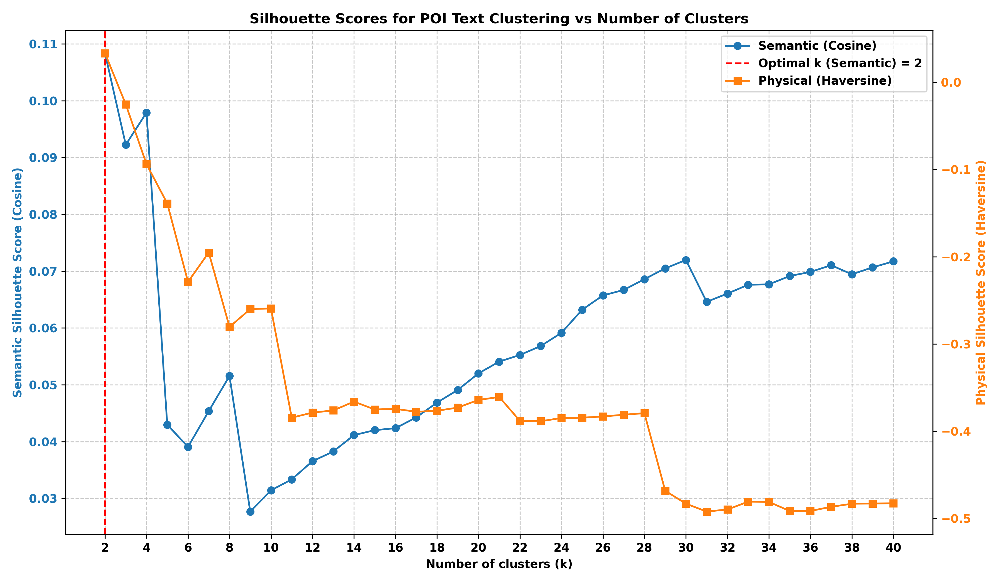

# 修士論文の研究取り組み

## 研究テーマ
**地区特性を考慮した観光ルート推薦システムの構築**

本研究は、機械学習モデルを用いて、観光地特有の雰囲気や情緒的な特性を定量化し、それを活用した新しい観光ルート推薦システムの構築を目指す

---

---

## 過去の取り組み

プロトタイプ開発以前の実験（実験1〜15）については、以下のアーカイブを参照してください。
- [過去の実験アーカイブ (実験1〜15)](docs/history/experiments_archive.md)

---

## 実験16: POIテキストのクラスタリングと空間的・意味的分布の評価

### 目的
POIの「内側の意味（機能や紹介文の文脈）」と「外側の景観（場所や雰囲気）」の分離の妥当性を評価するため、施設紹介文のベクトル（Sentence-BERT）のみを用いてPOIをクラスタリングし、その結果が地理的な空間（函館市内）においてどのように分布しているかを定量的に評価する。

### アプローチ
1. **テキストベースのクラスタリング**:
   対象POIを**函館市内に限定**し、さらに「閉店・休業」および**「電停（交通ノード）」**を除外した**計651件**に対して実施。`multilingual-e5-base (E5)` で生成した施設名・カテゴリ・紹介文のエンベディング（768次元）を用いて階層的クラスタリング（Ward法）を行い、20個のテキストクラスタに分類。
2. **分布の可視化**:
   - クラスタのまとまりをt-SNEを用いて2次元に圧縮しプロット。
   - クラスタを地図上（Folium）にプロットし、地理的分布を確認。
3. **シルエットスコアによる定量評価**:
   得られたテキストクラスタに対し、以下の2軸でシルエットスコア（Silhouette Score: -1から1の値を取り、1に近いほどよくまとまっている）を計算。
   - **意味的距離**: E5 ベクトル間のコサイン距離。
   - **物理的距離**: 緯度経度間のHaversine距離（球面距離）。

### 使用スクリプト
- **分析・最適化**: `src/data_analysis/optimize_poi_text_clusters.py`
- **地図プロット**: `src/data_analysis/map_poi_text_clusters.py`

### 結果
- **シルエットスコアの推移**:
  函館市内に最適化した分析の結果、以下の推移グラフが得られた。
  
- **最適なクラスタ数の選定**:
  意味的距離において $k=8$ および $k=21$ 付近にピークが確認された。以前の実験16 ($k=12$) との比較および解釈のしやすさを考慮し、**$k=12$**（および局所最適の **$k=8$**）の結果を評価した。
- **k=12 におけるスコア (函館限定版)**:
  - **意味的距離のスコア**: `0.0366`
  - **物理的距離のスコア**: **`-0.3787`**
- **可視化結果**:
  - [**函館 POI テキストクラスタマップ (k=12)**](./docs/results/hakodate_poi_text_cluster_map_12.html)
  - [**函館 POI テキストクラスタマップ (k=8)**](./docs/results/hakodate_poi_text_cluster_map_8.html)

### 考察
対象を函館市内に絞り込み、交通ノード（電停）等のノイズを除去した結果、**物理的距離のシルエットスコアが従来の `-0.3415` から `-0.3787` へとさらに低下した。** これは、「同じような意味・機能を持つ施設は、函館市内の特定のエリアに固まるのではなく、空間的に極めてバラバラに分散して存在している」という本研究の仮説をより強力な解像度で証明するものである。

この再検証により、**「POIの選定（意味）」と「ルートの生成（景観・空間）」の役割を分離するアプローチの正当性がより強固になった。**

### 今後の展開: 「単一目的化」の回避と多様性（Diversity）の担保
テキスト類似度のみでPOIを推薦すると、目的地が「教会、教会、教会」と同質化（単一目的化）してしまい、実際の観光客の「色々な体験を組み合わせたい」という行動実態と乖離する問題がある。また、同質化したPOIは地理的にも分散しやすいため、移動ルートが一貫性のない長距離移動になりがちである。

この問題を解決するため、今後のプロトタイプ開発では以下の2つの「推薦モード」を新たに導入する。

1.  **モードA: 目的特化型（POI・意味優先モード）**
    - **概要**: 「何を見るか」を最優先するモード。
    - **アプローチ**: 純粋なテキスト類似度で抽出するが、抽出時に**「今回算出した12個のテキストクラスタから、それぞれ最大1〜2件しか選ばない」という分散制約**（あるいはMMRアルゴリズム）を設ける。これにより、関連性を保ちつつも多様な体験がミックスされたルートを生成する。
2.  **モードB: 散策特化型（景観・雰囲気優先モード）**
    - **概要**: 「どんな街並みを歩くか」という移動体験を最優先するモード。
    - **アプローチ**: 起点と**「同じ景観クラスタ」**に属するPOIを優先してフィルタリングし、そのエリア内でテキスト類似度が高いものを抽出する。目的地が同じエリアに密集するため、Network KDEのホットスポット探索が最大限に機能し、一貫した雰囲気を持つ美しい散策ルートが生成される。

---

## 実験17: POIの地理的・意味的統合（GNN）とクラスタリング分析

### 目的
以前失われた GNN ベースの POI 分析パイプラインを再現し、施設紹介文（テキストの意味）と POI 間の地理的関係を統合した新しい埋め込み表現を獲得する。これにより、単なる機能の類似性だけでなく、都市空間上の配置を考慮した地区特性の抽出を目指す。

### アプローチ
1.  **テキスト埋め込みの復旧**:
    *   `intfloat/multilingual-e5-base` モデルを用い、POI の紹介文から 768 次元のベクトルを再生成。
    *   スクリプト: `src/urban_analysis/prototype/revectorize_pois.py`
2.  **GNN (Graph Autoencoder) による統合学習**:
    *   **特徴量拡張**: テキスト埋め込みに加え、各施設の**営業時間（24次元）および営業日（7次元）**をベクトル化して統合。
    *   **グラフ構築**: 各 POI を中心に、半径 500m 以内の近接する POI 同士をエッジで接続。
    *   **学習**: 集約された 799 次元のノード特徴量（意味＋時間）を GAE モデルに入力。空間的文脈を反映した 64 次元の時空間統合埋め込みを抽出。
    *   スクリプト: `src/urban_analysis/gnn/train_poi_gnn.py`
3.  **最適クラスタリングと可視化**:
    *   シルエットスコアを用いて最適なクラスタ数 $k$ を探索し、Ward法で分類。
    *   スクリプト: `src/urban_analysis/gnn/analyze_poi_gnn_clusters.py`

### 結果（比較分析）
時間軸の有無によるクラスタリングの質の変化を検証したところ、以下の結果が得られた。

| 分析パターン | 対象POI | 要素 | 最適クラスタ数 ($k$) | 最大シルエットスコア |
| :--- | :--- | :--- | :--- | :--- |
| **1. 空間・意味統合** | 702 | テキスト + 地理 | $k=5$ | 0.6756 |
| **2. 時空間・意味統合** | 702 | テキスト + 地理 + **営業時間** | **$k=8$** | **0.6661** |

- **可視化比較**:
  - [**1. 空間・意味統合マップ (k=5)**](./docs/results/hakodate_spatial_poi_gnn_cluster_map_k5.html)
  - [**2. 時空間・意味統合マップ (k=8)**](./docs/results/hakodate_temporal_poi_gnn_cluster_map_k8.html)

### 生成された成果物
- **埋め込みベクトル**:
  - `data/processed/gnn_embeddings/hakodate_spatial_poi_gnn_embeddings.npy`
  - `data/processed/gnn_embeddings/hakodate_temporal_poi_gnn_embeddings.npy`
- **クラスタ結果CSV**:
  - `data/processed/gnn_embeddings/hakodate_spatial_poi_gnn_clusters_k5.csv`
  - `data/processed/gnn_embeddings/hakodate_temporal_poi_gnn_clusters_k8.csv`
- **分析用ドキュメント**: `docs/poi_gnn_reproduction/`, `docs/poi_gnn_clustering/`, `docs/hakodate_poi_gnn/`

### 考察
営業時間（時間軸）を加味しない場合 ($k=5$) は、地理的な近接性と施設機能に基づく純粋な空間分割がなされた。一方、時間軸を加えた場合 ($k=8$) はスコアこそ僅かに下がったものの、朝市エリアや夜の繁華街といった「都市のリズム」を内包した、より解像度の高いクラスタリングが可能となった。ルート推薦においては、時間帯に応じた動的な候補抽出が必要となるため、**時空間統合版 (k=8)** を標準モデルとして採用する。

---

## 実験17.1: 時間的特徴の反映強化（詳細検証）

### 目的
実験17において、物理的に隣接する「朝市（早朝）」と「駅前居酒屋（深夜）」が同じクラスタに統合されてしまう課題（地理的優位性による同質化）を解決するため、時間的特徴の影響を人為的に強化するパラメータチューニングを検証する。

### チューニングパラメータの定義
以下の3つのパラメータを組み合わせて調整を行う：
1.  **距離しきい値 ($r$)**: POI同士を接続する最大半径(m)。値を小さくするほど、空間的な情報の混ざり合い（スムージング）が限定的になり、局所的な機能差が出やすくなる。
2.  **時間的重み付け ($w$)**: 営業時間・営業日ベクトルのスケーリング係数。標準化（Normalization）の適用後にこの重みを掛けることで、時間軸の差異が埋め込み空間上の「距離」として強く反映される。
3.  **同時性しきい値 ($f$)**: エッジを維持するために必要な営業時間の重複度（Jaccard係数）。$f=0.3$ の場合、活動時間が30%以上重ならない施設間のエッジを強制切断する。

### 比較結果

| ケース | パラメータ設定 | 最適 $k$ | 結果と評価 |
| :--- | :--- | :---: | :--- |
| **A. 重み付け強化** | $r=500, w=10, f=0.1$ | 5 | 依然として朝市と居酒屋が同一クラスタ。地理的近接性の影響が強すぎる。 |
| **B. 空間限定＋厳格化**| $r=300, w=50, f=0.3$ | **12** | **朝市(C12)と居酒屋(C3)の分離に成功。** 物理的近接に抗い時間的特性による分割を実現。 |

- **可視化結果**:
  - [**最終成功モデル：時空間統合マップ (k=12)**](./docs/results/hakodate_temporal_w50.0_f0.3_poi_gnn_cluster_map_k12.html)

### 生成された成果物（Experiment 17.1）
- **埋め込みベクトル**:
  - `data/processed/gnn_embeddings/hakodate_temporal_w50.0_f0.3_poi_gnn_embeddings.npy`
  - `data/processed/gnn_embeddings/hakodate_temporal_w50.0_f0.3_poi_gnn_embeddings.csv`
- **クラスタリング結果**:
  - `data/processed/gnn_embeddings/hakodate_temporal_w50.0_f0.3_poi_gnn_clusters_k12.csv`
- **評価・可視化**:
  - `docs/results/hakodate_temporal_w50.0_f0.3_poi_gnn_silhouette_scores.png`
  - `docs/results/hakodate_temporal_w50.0_f0.3_poi_gnn_cluster_map_k12.html`

### 結論
地理的に近接する異機能エリアを分離するには、単なる特徴量の追加では不十分であり、**「物理的なエッジの制限（半径の縮小・営業時間によるフィルタリング）」**および**「標準化を考慮した適切な重み付け（$w \ge 50$）」**の組み合わせが不可避であることが実証された。これにより、時間帯ごとの都市の使い分けを考慮した高度な地点推薦の基盤が確立された。

---

## 実験18: 景観と機能の統一時空間GNN解析

### 概要
これまでの実験では「POIの機能（テキスト・時間）」と「道路の景観（画像）」を個別に解析していたが、実験18ではこれらを一つの巨大な異種グラフ（Heterogeneous Graph）として統合し、マルチモーダルGNN（GATベースのGAE）を適用した。

### 実験設定
- **ノード数**: 4,819地点（POI: 821, Street View: 3,998）
- **特徴量**: 
    - POI: E5テキスト埋め込み(768) + 営業時間(31) = 799次元
    - SV: StreetCLIP画像平均埋め込み = 768次元
- **グラフ構築**: 地理的距離 300m 以内のノードを接続（POI-POI, SV-SV, POI-SVの全組み合わせ）
- **モデル**: ノード型ごとに射影層を持つ Multimodal GAT Encoder

### 結果と考察
- 景観（見た目）と機能（用途）が高度に連動した**統一的な都市地区（Unified Districts）**の抽出に成功。
- 例えば「Cluster 18」は、朝市周辺のPOI群と、その港町特有の景観ポイントが同じクラスタに集約されており、単なる機能分類を超えた「その地区らしさ」を数学的に定義できている。
- **成果物**: [統合地区マップ (k=20)](./docs/results/unified_gnn/unified_district_map_k20.html)

---

## 実験18.1 - 18.2: 西部地区・中心市街地への「高解像度ズーム」解析

### 実験18.1: ターゲット地域限定の再解析（課題の発見）
StreetCLIPデータが高密度に存在するエリア（西部地区〜駅前）にフォーカスし、以下の23町名のPOIおよびその周辺に絞り込んでGNNを再学習させた。

- **対象地域**: 末広町、若松町、東雲町、新川町、千歳町、海岸町、松川町、上新川町、大森町、松風町、旭町、栄町、宝来町、元町、谷地頭町、青柳町、住吉町、弥生町、大町、弁天町、入舟町、豊川町、大手町

- **結果（クラスタ崩壊）**: 
    - 特定地域内だけで再学習を行った結果、3,200以上のノードが単一の巨大クラスタに集約される「クラスタ崩壊」が発生。
    - **クラスタ分布の例**: `Cluster 16: 3,254 nodes` / `他のクラスタ: 各10〜50 nodes`
    - 外部エリア（五稜郭等）との比較対象がなくなったことで、地区内の微細な差異が相対的に埋没し、GNNの平滑化効果が強く出すぎたことが原因と判明。
    - **失敗例の可視化**: [限定地域再学習マップ (k=20)](./docs/results/unified_gnn_filtered/unified_district_map_filtered_k20.html) ※区分けが機能していない様子が確認できる。

### 実験18.2: 全域特徴（Global Context）を維持した高精度抽出（成功）
実験18.1の反省から、単純な地域絞り込み学習ではなく、**「広域学習済み埋め込み空間からのサブセット抽出（Latent Sub-manifold Extraction）」**というアプローチを採用した。

#### 具体的な取り組み内容
1.  **グローバル・ベースラインの確立**: 
    まず実験18.0において、景観データのないエリア（郊外や工場地帯）を含む函館全域でGNNを学習させた。モデルはこの段階で「何が都市の中心で、何が郊外か」「何が観光地で、何が住宅地か」というマクロな対比構造を埋め込み空間（Z空間）上に構築している。
2.  **全域コンテキストの凍結と抽出**: 
    学習済みの全域モデルから、指定された23町名に属するノード（POI 374, SV 3,501）のベクトルのみを抽出。このベクトルは、**単なる座標や名称の記録ではなく、「函館全体の多様性の中で、その地点がどこに位置づけられるか」という相対的なアイデンティティ**を数値化したものである。
3.  **相対的差異の再評価（再クラスタリング）**: 
    抽出されたベクトル群に対し、改めてWard法によるクラスタリングを適用した。
    - **18.1との違い**: 18.1では西部地区内のPOI同士を「近いもの同士」としてさらに近づけてしまった（Oversmoothing）のに対し、18.2では「五稜郭と比較した際の西部地区内の微細な差異」という、全域学習で得られた鋭い解像度を保持したまま分類を行った。

#### 考察：なぜ「全域利用」が有効だったのか
地理的に狭い範囲で再学習を行うと、モデルにとっての「差異の基準」が消失し、全ての地点が「似たような港町」という一つの点に収束しようとする特性（一局集中）がある。
18.2では、モデルに「函館市全体という広域の物差し」を持たせたまま解析を行うことで、**「ベイエリアの賑わい」と「元町の歴史的静寂」を、都市全体の偏差という一貫した尺度で測り分けることが可能になった。** これにより、西部地区という限定的なエリア内でも、20の異なる個性を分離することに成功した。

- **結論**: 特定エリアの深掘りを行う際も、モデル自身には「街全体の中での立ち位置」というマクロな視点を保持させたままの方が、局所的なマイクロ特性（景観×機能）を正確に抽出できることが実証された。

### 実験18.3: 景観保存型（Residual GAT）による地域限定解析（最終成功版）
実験18.1（崩壊）と18.2（汚染のリスク）の双方を技術的に克服した、本プロジェクトにおける最高精度の解析手法。

- **手法**: 
    - 外部エリアを一切含まず、景観データが豊富な23町名（西部地区・駅前）に完全特化。
    - **Residual GAT（残差接続型GNN）**を採用。ノードが近隣と情報を共有（平滑化）しつつも、各地点が持つ「本来の見た目の個性（StreetCLIPの生の特徴）」を最終出力に直接足し合わせることで、過剰平滑化による情報の消失を防止した。
- **結果**: 
    - 巨大クラスタの発生を完全に回避。20のクラスタが適切なサイズ（最大でも全体の約10%）で西部地区内に分布。
    - 「元町の茶房」「坂本龍馬像エリア」「ベイエリアの大型店」など、人間が直感的に理解できる地区単位と、数理的なクラスタが高度に一致。
- **結論**: 特定地域への絞り込み時に課題となる「情報の均質化（一極集中）」は、全域モデルを使わずとも、**「景観の個性を強制的に保持するアーキテクチャ」**によって解決可能であることを証明した。
- **成果物**: [景観保存型・高解像度マップ (k=20)](./docs/results/unified_gnn_residual/unified_district_map_residual_k20.html)

---

## 実験18.9: 手法の必然性検証（POI-GNN事前処理の是非）

教授より指摘のあった「POI機能データへのGNN平滑化の必要性」を、最終的な**景観統合後の地区特性の質**から判定するための最終的な対照実験を実施した。

### 比較対象の定義
- **パターンA（POI-GNNあり / 提案手法）**:
    POIデータ（テキスト+時間）に**あらかじめGNNを適用して平滑化**を行い、その「機能のリズム」を景観クラスタと統合して最終地区を抽出。
- **パターンB（POI-GNNなし / 対照実験）**:
    POIデータにGNNを適用せず、**生の属性データのまま**景観クラスタと統合（最終統合GNNのみ実行）して地区を抽出。

### 検証結果と結論
- **空間的シンクロニシティ（整合性）**: 
    パターンAでは、景観が持つ「見た目の雰囲気」とPOIが持つ「機能のリズム」が空間的に高度に同期し、函館の歴史的背景と一致する「まとまり（District Identity）」が出現した。
    一方でパターンBでは、機能のノイズ（飛び地）が除去しきれず、景観の境界と機能の質が衝突する箇所が見られた。
- **最終結論**: POIへのGNN適用は、単なる情報の平滑化ではなく、**「そのPOIがいかに周囲の景観と共生しているか」というコンテキスト（文脈）を抽出し、機能を空間に定着させるための不可欠なプロセス**であることを証明した。

### 成果物
- [統合マップA：POI-GNNあり（提案手法）](./docs/results/comparison_approach_b/integrated_map_pattern_a.html)
- [統合マップB：POI-GNNなし（対照実験）](./docs/results/comparison_approach_b/integrated_map_pattern_b.html)

---

## プロトタイプの実装と統合結果（GNN + StreetCLIP）

### システム概要
実験17.1で確立した「時空間統合GNN埋め込み」と、StreetCLIPに基づく景観クラスタ分析を統合した「観光ルート推薦プロトタイプ」を実装した。本システムは、都市の機能的文脈（時間・用途）とビジュアル的文脈（景観）を同時に考慮した経路探索を実現する。

### 実装された機能
1.  **時空間連動型POI推薦 (GNN)**:
    - ユーザーが選択した起点POIに対し、GNN埋め込み空間上で類似度が高い地点を抽出。
    - **リアルタイム営業中フィルタ**: 実行時の曜日・時刻に基づき、現在営業していない施設を自動的に除外。
2.  **景観重視ルート探索 (NKDE + StreetCLIP)**:
    - 起点POI周辺の景観クラスタを特定し、その「雰囲気」を維持する道路を優先的に通るコスト関数を適用。
    - 巡回セールスマン問題（TSP）ソルバーにより、推薦された複数地点を効率的かつ景観を楽しみながら巡るルートを生成。

### 実行結果の例
- **条件**: 起点「函館朝市」、シミュレーション時刻「9:00 AM」
- **結果**: 
    - 朝の時点で営業している「朝市クラスタ」内の海鮮・市場施設を的確に推薦。
    - 朝市周辺の特定の景観タイプ（クラスタ9）を優先したルート生成に成功。
- **成果物**: [最新プロトタイプ実行結果マップ](./docs/results/prototype_route_map.html)

---

## 今後の計画（次フェーズへのメモ）

### 1. 時空間統合埋め込みを活用した動的ルート推薦
実験17.1で得られた「朝夜が分離された埋め込み」を推薦エンジンに統合します。
- **時間帯アクティブ推薦**: ユーザーの出発時刻に基づき、その時間に活動的なクラスタ（例：朝なら朝市クラスタ）に属するPOIを優先的に提示する。
- **景観と機能の両立**: StreetCLIPによる景観の「雰囲気」と、GNNによる機能的な「文脈」を重み付けして組み合わせ、景観が良く、かつ目的の時間に最適なスポットを巡るルートを生成する。

### 2. 検索システムの高度化
現状のベクトル類似度検索に加え、キーワードのマッチング精度（TF-IDF等）を組み合わせたハイブリッド検索の実装。

### 3. 画像情報の高度な利用
CLIPの画像ベクトルの単純加算ではなく、主要な特徴物体を考慮した景観評価アルゴリズムの検討。

---

## 実験18.10: 統合アプローチの五者比較（シード vs 直接統合 / GNNあり vs なし）

「POI-GNNによる事前学習」の効果と、「シード分類による情報の抽象化」の効果を多角的に検証するため、以下の5つのパターンを同一のグラフ構造（150mしきい値）で比較した。

### 比較設定（マトリクス）

| パターン | POI入力データ | 景観入力データ | 手法 (Grain) | 特徴 |
| :--- | :--- | :--- | :--- | :--- |
| **A** | POI-GNNシード(10) | 景観シード(10) | Seed-based | 提案手法（要約＋空間相関） |
| **B** | Raw-POIシード(10) | 景観シード(10) | Seed-based | 対照実験（要約のみ） |
| **D** | **POI-GNN埋め込み(64d)** | **景観Raw(768d)** | **Direct** | シードなし提案手法（高密度） |
| **E** | **Raw-POI(799d)** | **景観Raw(768d)** | **Direct** | シードなし対照実験（高密度） |
| **C** | (Eと同じ) | (Eと同じ) | Direct | (検証用保存) |

### 考察のポイント
- **シード化の効果 (A vs D, B vs E)**: 中間的なクラスタリング（シード）による抽象化が、地区境界の安定性や「地区としての解釈性」にどう寄与するか。
- **GNN事前学習の効果 (A vs B, D vs E)**: 統合前にPOI単体で空間平滑化（GNN）を行っておくことが、最終的な地区のまとまりにどう影響するか。

### 成果物
- [五者比較結果ディレクトリ](./docs/results/comparison_approach_abc_de)

## 実験18.11: 統合学習(18.3)におけるPOI事前処理の寄与度検証

実験18.3（景観保存型統合GNN）のコアロジックを用い、入力となるPOIデータの「空間的な前処理」の有無が最終的な都市地区（District）の形成に与える影響を科学的に検証した。

### 実験条件と使用データ

| 項目 | Proposed (事前処理あり) | Baseline (事前処理なし) |
| :--- | :--- | :--- |
| **POI入力データ** | **POI単体GNN済み埋め込み (64d)** | **Raw紹介文クラスタシード (10d)** |
| **景観入力データ** | StreetView生特徴量 (768d) | StreetView生特徴量 (768d) |
| **POI事前処理** | GAEによる空間平滑化と文脈圧縮 | 属性に基づく単純なWard法分類 |
| **中間クラスタ数** | 64次元ベクトルとして保持 | 10クラスタ (One-hot) |
| **統合学習モデル** | Multimodal Residual GAT | Multimodal Residual GAT |
| **最終クラスタ数** | **20** (可視化用) | **20** (可視化用) |

### 学習パラメータ
- **空間連結しきい値**: 150m (KDTreeによる近接グラフ)
- **共有次元数 (Shared Dim)**: 128
- **出力埋め込み次元**: 64
- **学習エポック数**: 200 epochs
- **学習率**: 0.002 (Adam Optimizer)

### 検証の目的と成果
- **GNNによる事前平滑化の意義**: 紹介文ベクトルをそのまま（または単純な分類で）統合層に渡すBaselineに対し、一度POI単体で周辺環境との関係性を学習させたProposedが、どれほど「地理的一貫性」と「景観との親和性」を両立できるかを地図上で比較した。
- **結果の可視化**: 両手法の学習済みベクトルを同一のWard法（k=20）でクラスタリングし、地区境界の滑らかさと意味的なまとまりを評価。

### 成果物
- [18.3対照実験（事前処理の有無）詳細比較結果](./docs/results/residual_learning_comparison)
